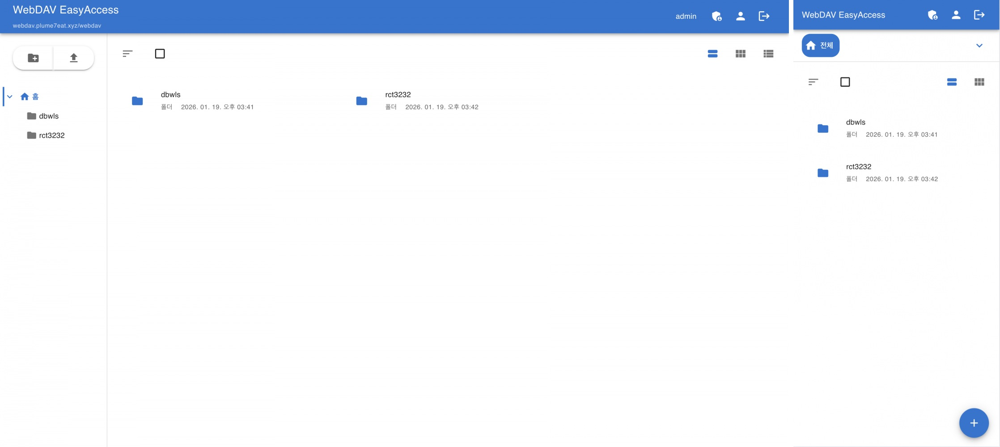
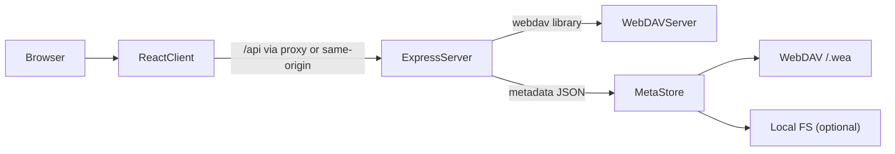

# WebDAV EasyAccess

WebDAV EasyAccess is a **self-hosted, multi-user file management system** built on top of a WebDAV server.

Unlike a simple client, it runs via a **dedicated Node.js server**, and users can manage files through a web browser without installing any software. Authentication and permission logic are handled on the server side, providing a secure multi-user environment and media preview capabilities.

> **Important**: This project's code and documentation were **written entirely by an AI Agent**. Review from security, quality, and licensing perspectives before deploying to production.

## Screenshot



## Key Features

- **Server-based architecture**: Node.js backend manages WebDAV connections; users interact only through the web interface.
- **Multi-user system**: Built-in account system with signup approval workflow.
- **Fine-grained permission control**: Per-folder user permissions (read/write/admin) beyond WebDAV's default capabilities.
- **Media preview**: View images and videos instantly in the browser via server-generated thumbnails.
- **External share links**: Create time-limited public links for files; anyone with the link can view or download without logging in.
- **Recent files**: Recently accessed files appear in the left sidebar; the list updates automatically on rename, move, or delete.
- **Internationalization (i18n)**: UI supports Korean and English; language is auto-detected from the browser.

## Architecture



## Tech Stack

- **Backend**: Node.js, Express.js
- **Frontend**: React, MUI (Material UI)
- **Auth**: JWT
- **WebDAV Client**: `webdav`
- **Thumbnails**: Sharp (FFmpeg required for video)
- **Metadata store**: JSON under WebDAV `/.wea/` (optional local filesystem storage)

## Documentation

- [docs/SETUP.md](docs/SETUP.md) — Installation and environment setup
- [docs/ARCHITECTURE.md](docs/ARCHITECTURE.md) — Server architecture, middleware, metadata store, API overview
- [docs/CODING_STYLE.md](docs/CODING_STYLE.md) — Coding style and patterns (naming, React/Express conventions)
- [docs/TESTING_STRATEGY.md](docs/TESTING_STRATEGY.md) — What to test, unit vs integration, mocking, checklist for new code
- [docs/TEST_GIT_GUIDE.md](docs/TEST_GIT_GUIDE.md) — Running tests, Git workflow, CI, coverage
- [docs/api.md](docs/api.md) — REST API reference (endpoints, auth, request/response)
- [docs/shared-contracts.md](docs/shared-contracts.md) — Shared contracts (errors, validation, constants, paths)
- **Feature docs:** [permissions](docs/features/permissions.md) · [auth, users & settings](docs/features/auth-users-settings.md) · [files & sharing](docs/features/files-sharing.md) · [admin & infrastructure](docs/features/admin-infrastructure.md) · [client UI](docs/features/client-ui.md)

## Installation & Running

For detailed installation and setup, see [`docs/SETUP.md`](docs/SETUP.md).

### Quickstart

```bash
# 1) Install
npm run install-all

# 2) Configure env
cp .env.example .env

# 3) Run (dev: client + server)
npm run dev
```

- Access: `http://localhost:3000`

## Production

In production, build the frontend first; the server serves `client/build` as static assets.

```bash
# 1) Build frontend
npm run build

# 2) Start server
cd server
npm start
```

- Access: `http://localhost:5001` (or `PORT` from `.env`)

## Environment Variables (.env)

`.env` should be placed at the **repository root**. The server reads it (required), and the client proxy uses `PORT` during development.

### Required

- **WEBDAV_URL**: WebDAV server URL (path prefix allowed)
- **WEBDAV_USERNAME / WEBDAV_PASSWORD**: WebDAV credentials
- **JWT_SECRET**: JWT signing key (must be changed in production; server will not start if unset)
- **PORT**: Server port (default `5001`)

### Optional (main)

- **JWT_EXPIRES_IN**: JWT expiration (default `30m`, e.g. `15m`, `1h`)
- **EMAIL_HOST/EMAIL_PORT/EMAIL_SECURE/EMAIL_USER/EMAIL_PASSWORD/EMAIL_FROM_NAME**: SMTP for signup/approval notifications
- **ADMIN_DEFAULT_PASSWORD**: Default admin password (default `admin`)
- **WEA_DISABLE_DEFAULT_ADMIN**: Disable default admin auto-creation (`true`)
- **WEA_STORAGE_BACKEND**: Metadata storage (`webdav` or `fs`, default `webdav`)
- **WEA_FS_DIR / WEA_METADATA_DIR**: Storage path when using `fs` backend
- **CORS_ORIGINS / CORS_ORIGIN**: Allowed CORS origins (recommended in production; comma-separated)
- **LOGIN_RATE_LIMIT_WINDOW_MS / LOGIN_RATE_LIMIT_MAX**: Login rate limit (best-effort, in-memory)
- **WEBDAV_AUTH_TYPE**: `auto` / `basic` / `digest`
- **WEBDAV_UPSTREAM_URL**: Upstream base URL for MOVE/COPY issues behind a proxy (502, etc.)
- **MAX_THUMBNAIL_SIZE**: Max thumbnail resolution (default `300`)
- **FFMPEG_PATH**: FFmpeg path (when auto-detect fails)
- **THUMBNAIL_CONCURRENCY_LIMIT**: Max concurrent thumbnail tasks (default `10`)

## Security Notes

- **Logout on browser close**: Auth tokens are stored in `sessionStorage`; closing the browser (tab/window) logs you out automatically.
- **Re-login on password change**: Changing the password increments `token_version` on the server, invalidating all existing tokens (including on other devices).
- **HTTPS recommended/required**: In HTTP or mixed environments, tokens and credentials can be intercepted. Production deployments should **enforce HTTPS**.

## Permission Policy (Summary)

- **Permission levels**: `read` / `write` / `admin`
- **Owner exception**: User root folder `/{username}` and its children always grant read/write to that user.
- **Read**: **Direct-only** (no inheritance). Read is required on each folder to list it, and on a file's parent folder to read the file. Read on `/share` does not grant read on `/share/sub` unless explicitly granted.
- **Write**: Shared paths use **direct-only write** (no inheritance).
  - Example: Write on `/share` does not imply write on `/share/sub` unless explicitly granted.
- **Reserved path**: `/.wea` is reserved for metadata; hidden/blocked in UI and server.

## Usage

### General Users

1. **Sign up and log in**
   - Signup available when enabled by admin
   - New users wait for admin approval (email notification)
   - After approval, log in to access your home folder (`/username`)

2. **File management**
   - Drag & drop: upload, move, copy
   - Right-click: download, rename, move, copy, delete
   - Preview: click files to view images, video, PDF, text
   - View modes: grid, list, detail
   - Bulk operations: multi-select files/folders, then use the toolbar for move, copy, download (ZIP), or delete (with progress and cancellation)
   - Recent files: recently accessed files appear in the left sidebar

3. **Folder sharing**
   - Right-click file or folder → "Share" to grant permissions to other users
   - Manage shared folders from MyPage
   - Received shares appear under "Shared" in the left folder tree

4. **Permission requests**
   - Users can **request** folder access from owners (separate from admin approval)
   - Requests appear in MyPage inbox (for owners) and outbox (for requesters)
   - Owners approve or reject; requesters can cancel pending requests

5. **External share links**
   - In Share dialog → "External share" tab: create time-limited public links for files
   - Anyone with the link can view/download without logging in
   - Manage share links in MyPage → Share Links tab
   - Recipients can add the shared item to their own permissions if they have an account

6. **MyPage**
   - User icon (top right): change password/email
   - Manage shared folders under your home directory
   - Permission request inbox/outbox
   - Share links management

### Administrators

1. **First login**
   - Default: `admin` / `admin` (or `ADMIN_DEFAULT_PASSWORD`)
   - Change the password immediately

2. **User and settings management**
   - Approve/reject new signups; add/delete users directly
   - Enable/disable signup
   - Grant and manage per-user folder permissions

## Testing

- **What to test and how:** [docs/TESTING_STRATEGY.md](docs/TESTING_STRATEGY.md) (unit vs integration, mocking, checklist for new code).
- **Running tests, Git, and CI:** [docs/TEST_GIT_GUIDE.md](docs/TEST_GIT_GUIDE.md).
- **Client:** `cd client && npm run test:unit` | `npm run test:integration` | `npm run test:ci` — Summary: [client/TEST_SUMMARY.md](client/TEST_SUMMARY.md).
- **Server:** `cd server && npm run test:unit` | `npm run test:integration` | `npm run test:ci` — Summary: [server/TEST_SUMMARY.md](server/TEST_SUMMARY.md).

## Troubleshooting

### WebDAV URL with path prefix

Paths like `https://example.com/webdav` are supported. If connection fails, verify URL and credentials; server behavior may vary.

### MOVE/COPY returns 502 (proxy environment)

Reverse proxies may block or alter the `Destination` header. Set `WEBDAV_UPSTREAM_URL` to the **actual upstream base URL** to work around this.

### Video thumbnails not generated

FFmpeg is required. Set `FFMPEG_PATH` if auto-detect fails.

### Email not sending

Without `EMAIL_HOST`, `EMAIL_USER`, and `EMAIL_PASSWORD`, emails are not sent; output goes to console only.

### Upload fails with 409 (Conflict)

Normal when a file with the same name already exists. Rename the file or change the target path.

### `/.wea` path not visible

`/.wea` is a reserved path for metadata; it is hidden and blocked in the UI and server.

## License

MIT
