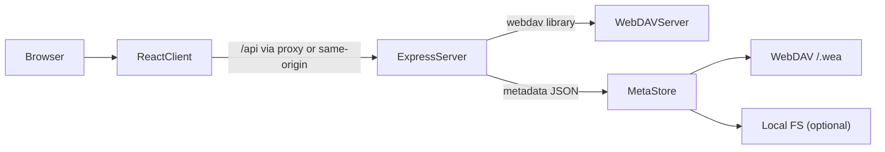

# WebDAV EasyAccess

WebDAV를 Google Drive처럼 웹에서 관리할 수 있는 **WebDAV 파일 관리자(웹 클라이언트)** 입니다.

> **중요**: 본 프로젝트의 코드/문서는 **AI Agent로만 작성된 프로젝트**입니다. 운영 환경에 투입하기 전, 보안/품질/라이선스 관점의 검토를 권장합니다.

## 스크린샷


## 주요 기능

### 인증 및 사용자 관리

- ✅ `.env`를 통한 WebDAV 자동 접속
- ✅ 서비스 자체 계정 생성/관리 (WebDAV 계정과 별개)
- ✅ 회원가입 승인 시스템 (관리자 승인 필요)
- ✅ 회원가입 활성화/비활성화 설정 (관리자)
- ✅ 이메일 알림 (승인 대기, 승인/거절 결과)
- ✅ 사용자별 전용 폴더 자동 생성
- ✅ 마이페이지 (비밀번호/이메일 변경)

### 관리자 기능

- ✅ 관리자 대시보드
- ✅ 회원 승인/거절 관리
- ✅ 사용자 수동 추가/삭제
- ✅ 사용자별 폴더 권한 관리

### 파일 관리

- ✅ 파일 업로드/다운로드/이름변경/삭제/이동/복사
- ✅ 드래그 앤 드롭으로 파일 이동/복사
- ✅ 파일 미리보기 (이미지, 비디오, PDF, 텍스트)
- ✅ 간단 리스트, 상세 리스트, 그리드(갤러리) 보기
- ✅ 이미지/동영상 썸네일 표시

### 폴더 공유 및 권한 관리

- ✅ 폴더별 사용자 권한 부여 (읽기/쓰기/admin)
- ✅ 공유 폴더 관리 (마이페이지)
- ✅ 받은 공유 폴더 관리 (쓰기 권한 요청/권한 반납)

## 아키텍처



## 기술 스택

- **Backend**: Node.js, Express.js
- **Frontend**: React, MUI(Material UI)
- **Auth**: JWT
- **WebDAV Client**: `webdav`
- **Thumbnails**: Sharp (+ Video는 FFmpeg 필요)
- **Metadata store**: 기본 WebDAV `/.wea/` 아래 JSON (옵션으로 local filesystem 저장 가능)

## 설치 및 실행

자세한 설치 및 실행 방법은 [`docs/SETUP.md`](docs/SETUP.md)를 참조하세요.

### Quickstart

```bash
# 1) Install
npm run install-all

# 2) Configure env
cp .env.example .env

# 3) Run (dev: client + server)
npm run dev
```

- 접속: `http://localhost:3000`

## 운영(Production)

운영 환경에서는 프론트엔드를 빌드한 뒤, 서버가 `client/build`를 정적 파일로 서빙합니다.

```bash
# 1) Build frontend
npm run build

# 2) Start server
cd server
npm start
```

- 접속: `http://localhost:5001` (또는 `.env`의 `PORT`)

## 환경 변수(.env)

`.env`는 **레포 루트**에 두며, 서버가 읽고(필수), 개발 시 클라이언트 프록시가 `PORT`를 참고합니다.

### 필수

- **WEBDAV_URL**: WebDAV 서버 URL (경로 prefix 포함 가능)
- **WEBDAV_USERNAME / WEBDAV_PASSWORD**: WebDAV 계정
- **JWT_SECRET**: JWT 서명 키(프로덕션에서 반드시 변경)
- **PORT**: 서버 포트 (기본값 `5001`)

### 선택(주요)

- **EMAIL_HOST/EMAIL_PORT/EMAIL_SECURE/EMAIL_USER/EMAIL_PASSWORD/EMAIL_FROM_NAME**: 가입/승인 알림 메일
- **ADMIN_DEFAULT_PASSWORD**: 기본 admin 비밀번호(기본 `admin`)
- **WEA_DISABLE_DEFAULT_ADMIN**: 기본 admin 자동 생성 비활성화(`true`)
- **WEA_STORAGE_BACKEND**: 메타데이터 저장소 선택(`webdav` 또는 `fs`, 기본은 `webdav`)
- **WEA_FS_DIR / WEA_METADATA_DIR**: `fs` 저장소 사용 시 저장 경로
- **WEBDAV_AUTH_TYPE**: `auto/basic/digest`
- **WEBDAV_UPSTREAM_URL**: 프록시 환경에서 MOVE/COPY가 502 등을 반환할 때 우회용 upstream base URL
- **MAX_THUMBNAIL_SIZE**: 썸네일 최대 크기(기본 `300`)
- **FFMPEG_PATH**: FFmpeg 경로(자동 감지 실패 시)

## 권한 정책(요약)

- **권한 레벨**: `read` / `write` / `admin`
- **Owner 예외**: 사용자 루트 폴더 `/{username}` 및 하위는 해당 사용자에게 항상 read/write로 취급됩니다.
- **읽기(Read)**: 상위 경로 권한을 포함한 **effective(상속) 읽기** 정책을 사용합니다.
  - 예: `/share`에 읽기 권한이 있으면, 하위 폴더 탐색에 필요한 읽기 권한을 상속하여 동작합니다.
- **쓰기(Write)**: 공유 경로는 기본적으로 **direct-only(직접) 쓰기** 정책을 사용합니다(상위 권한 상속 없음).
  - 예: `/share`에 쓰기 권한이 있어도 `/share/sub`에 직접 권한이 없으면 쓰기 작업이 제한될 수 있습니다.
- **예약 경로**: `/.wea`는 메타데이터 저장용 예약 경로로 UI/서버에서 숨김/차단됩니다.

## 사용 방법

### 일반 사용자

1. **회원가입 및 로그인**
   - 관리자가 활성화한 경우 회원가입 가능
   - 가입 후 관리자 승인 대기 (이메일 알림)
   - 승인된 계정으로 로그인하면 전용 폴더(`/사용자명`)에 접근

2. **파일 관리**
   - 드래그 앤 드롭: 업로드, 이동, 복사
   - 우클릭: 다운로드, 이름 변경, 이동, 복사, 삭제
   - 미리보기: 파일 클릭으로 이미지, 비디오, PDF, 텍스트 확인
   - 보기 모드: 그리드, 리스트, 상세 보기 전환

3. **폴더 공유**
   - 파일 또는 폴더 우클릭 → "공유"로 다른 사용자에게 권한 부여
   - 마이페이지에서 공유한 폴더 관리
   - 받은 공유 폴더는 좌측 폴더 트리의 "공유됨" 섹션에서 확인

4. **마이페이지**
   - 우상단 사용자 아이콘에서 비밀번호/이메일 변경
   - 홈 디렉토리 하위 폴더 공유 관리

### 관리자

1. **첫 로그인**
   - 기본 계정: `admin` / `admin` (또는 `ADMIN_DEFAULT_PASSWORD`)
   - ⚠️ 즉시 비밀번호 변경 권장

2. **사용자/설정 관리**
   - 신규 가입자 승인/거절, 사용자 직접 추가/삭제
   - 회원가입 기능 활성화/비활성화
   - 사용자별 폴더 권한 부여 및 관리

## 테스트

- **클라이언트**
  - `cd client && npm run test:unit`
  - `cd client && npm run test:integration`
  - `cd client && npm run test:ci`
  - 요약: `client/TEST_SUMMARY.md`
- **서버**
  - `cd server && npm run test:unit`
  - `cd server && npm run test:integration`
  - `cd server && npm run test:ci`
  - 요약: `server/TEST_SUMMARY.md`
- 테스트 코드 Git 관리 가이드: [`docs/TEST_GIT_GUIDE.md`](docs/TEST_GIT_GUIDE.md)

## 트러블슈팅

### WebDAV URL에 경로 prefix가 포함된 경우

예: `https://example.com/webdav` 처럼 URL에 경로가 포함되어도 동작하도록 처리되어 있습니다. 다만 서버별 차이가 있으므로, 연결이 실패하면 먼저 URL/인증 정보를 점검하세요.

### MOVE/COPY가 502 등으로 실패(프록시 환경)

리버스 프록시(또는 업스트림) 환경에서 `MOVE`/`COPY` 요청의 `Destination` 헤더가 차단/변형되는 경우가 있습니다. 이때 `WEBDAV_UPSTREAM_URL`로 **실제 업스트림 base URL**을 지정해 우회할 수 있습니다.

### 동영상 썸네일이 생성되지 않음

FFmpeg가 필요합니다. 자동 감지가 실패하면 `FFMPEG_PATH`를 설정하세요.

### 이메일이 발송되지 않음

`EMAIL_HOST`, `EMAIL_USER`, `EMAIL_PASSWORD`가 없으면 메일은 전송되지 않고 콘솔로만 출력됩니다.

### 업로드가 409(Conflict)로 실패

동일한 파일명이 이미 존재할 때 정상적으로 거부됩니다. 파일명을 바꾸거나 대상 경로를 변경하세요.

### `/.wea` 관련 경로가 보이지 않음

`/.wea`는 메타데이터 저장용 예약 경로로 UI/서버에서 숨김/차단됩니다.

## 라이선스

MIT

