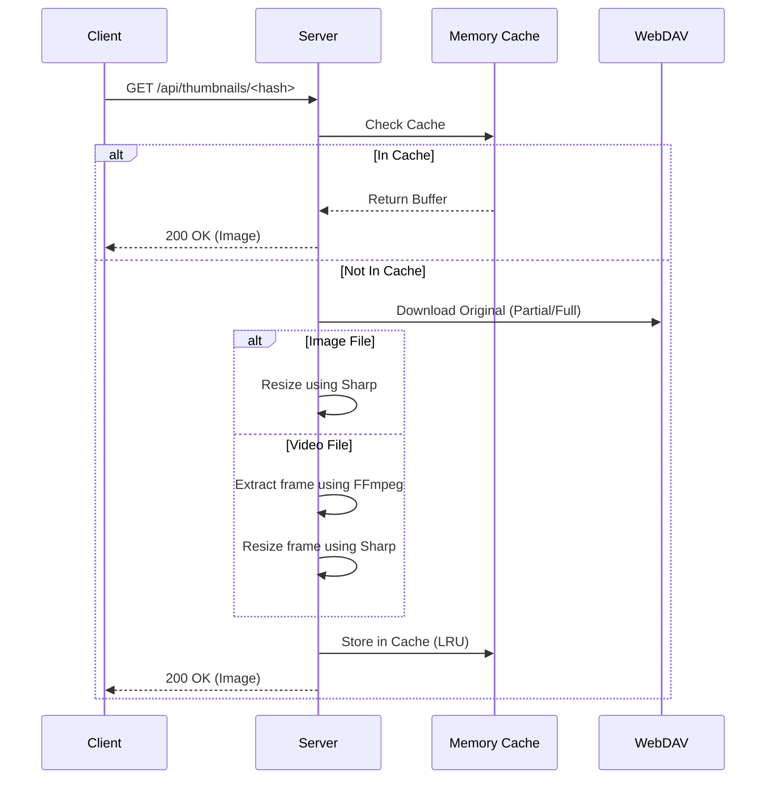

# 아키텍처 문서

## 개요

WebDAV EasyAccess는 React 프론트엔드와 Express 백엔드로 구성된 **설치형(Self-hosted) 다중 사용자 파일 관리 플랫폼**입니다. 기존 WebDAV 서버 위에 현대적인 웹 인터페이스와 정교한 사용자/권한 관리 레이어를 제공합니다.

---

## 1. 서버 아키텍처

### 1.1 미들웨어 파이프라인

모든 API 요청은 표준화된 미들웨어 체인을 통과하여 보안 및 데이터 정규화를 보장합니다:

```
Request → CORS → Body Parser → Request Logger → Auth (JWT) → User Loader → Path Normalizer → Meta Path Guard → Route Handler → Error Handler
```

#### 핵심 미들웨어
1.  **authenticateToken** (`server/utils/auth.js`): `Authorization: Bearer <JWT>` 헤더를 검증하고 `req.user.id`를 설정합니다.
2.  **requireUser** (`server/middleware/requireUser.js`): DB(Metadata Store)에서 사용자 상세 정보를 로드하여 `req.user.full`에 주입합니다.
3.  **normalizePathParam** (`server/middleware/normalizePathParam.js`): 요청의 `path` 파라미터를 POSIX 스타일로 정규화하고 중복 슬래시를 제거합니다.
4.  **checkMetaPathAccess** (`server/middleware/metaPathGuard.js`): 예약된 경로(`/.wea`)에 대한 비관리자의 접근을 원천 차단합니다.
5.  **errorHandler** (`server/utils/errorHandler.js`): 모든 라우트 에러를 catch하여 표준화된 JSON 응답(status, error, message)을 반환합니다.

### 1.2 권한 정책 (ACL)

시스템은 WebDAV 서버의 기본 권한과 별개로 **자체적인 ACL(Access Control List)**을 운영합니다.


*   **상속된 읽기 (Inherited Read)**: 부모 폴더에 권한이 있으면 하위 모든 항목에 접근 가능합니다.
*   **직접 쓰기 (Direct Write)**: 보안을 위해 쓰기 권한은 해당 폴더에 명시적으로 부여된 경우에만 인정됩니다 (상속되지 않음).
*   **소유자 예외**: `/{username}` 경로는 해당 사용자의 홈 디렉토리로 간주되어 항상 풀 권한이 부여됩니다.

---

## 2. 데이터 구조 및 저장소

### 2.1 메타데이터 스토리지 (Metadata Store)

전용 데이터베이스(MySQL, MongoDB 등) 대신, **JSON 기반의 파일 스토리지**를 사용합니다. 이는 WebDAV 서버 하나만으로 시스템 전체를 구동할 수 있게 하기 위함입니다.

*   **스토리지 백엔드 선택**: `.env`의 `WEA_STORAGE_BACKEND` 설정에 따라 결정됩니다.
    *   `webdav` (기본값): WebDAV 서버의 `/.wea` 폴더 내에 저장. (완전한 무상태성 유지 가능)
    *   `fs`: 서버 로컬 파일시스템에 저장. (성능상 이점)

#### 저장 구조 (Remote/Local)
```
/.wea/
├── users/
│   ├── _index.json      # 사용자 ID-Username 매핑 및 자동 증가 ID 관리
│   └── user1.json       # 사용자 프로필, 비밀번호 해시, 상태 등
├── permissions/
│   └── users/
│       └── 1.json       # User ID 1번의 폴더별 권한 설정 (ACL)
├── index/
│   └── email/
│       └── <hash>.txt   # 이메일 중복 체크 및 조회를 위한 역인덱스
├── locks/
│   └── <hash>.lock      # 분산 락 파일 (동시성 제어)
└── settings.json        # 시스템 전역 설정 (회원가입 활성화 여부 등)
```

### 2.2 동시성 제어 (Metadata Locking)

여러 사용자가 동시에 메타데이터를 수정할 때 데이터 유실을 방지하기 위해 **분산 락(Distributed Lock)** 메커니즘을 사용합니다 (`server/store/locks.js`).

1.  WebDAV의 `If-None-Match: *` 헤더를 이용한 원자적 파일 생성을 시도합니다.
2.  성공 시 락을 획득하고, 실패 시 일정 시간 대기 후 재시도합니다.
3.  락 파일 내부에 TTL을 기록하여, 서버 장애로 인한 데드락을 자동으로 해소합니다.

---

## 3. 핵심 파일 처리 로직

### 3.1 썸네일 시스템 (Thumbnail Engine)

미디어 파일의 쾌적한 탐색을 위해 서버 사이드 썸네일 생성을 지원합니다.



*   **성능 최적화**: 
    *   생성된 썸네일은 서버 메모리에 캐싱(최대 1000개)됩니다.
    *   클라이언트는 `batch` API를 통해 현재 뷰포트 내의 여러 썸네일을 한 번에 확인 요청합니다.
    *   비디오 썸네일은 FFmpeg가 설치된 환경에서만 동작하며, 서버 시작 시 1회만 가용성을 체크합니다.

### 3.2 재귀적 작업 엔진 (Selective Transfer/Delete)

WebDAV 서버에 따라 디렉토리 이동/삭제 시 권한 체크가 복잡해질 수 있습니다. 시스템은 이를 정교하게 처리하기 위해 `selective*` 서비스를 사용합니다.

*   **동작 방식**: 
    1.  대상 폴더 트리를 재귀적으로 탐색합니다.
    2.  각 단계에서 **현재 사용자의 ACL**을 확인합니다.
    3.  권한이 있는 항목만 선별적으로 이동/복사/삭제를 수행합니다.
    4.  작업 완료 후, 변경된 경로에 맞춰 ACL 데이터(`/.wea/permissions/...`)를 자동으로 갱신(Rewrite)하거나 삭제(Revoke)합니다.

---

## 4. API 가이드 (요약)

### 4.1 인증 (Auth)
*   `POST /api/auth/login`: 로그인 및 토큰 발급.
*   `POST /api/auth/register`: 회원 가입 요청.

### 4.2 파일 및 폴더 (Files/Folders)
*   `GET /api/files/list?path=...`: 폴더 목록 조회 (ACL 정보 포함).
*   `GET /api/files/download?path=...`: 단일 파일 다운로드.
*   `POST /api/files/upload`: 파일 업로드 (부모 권한 체크).
*   `PUT /api/files/move`: 경로 이동 및 ACL 자동 갱신.
*   `POST /api/files/download-multiple`: 다중 파일/폴더 선택 시 ZIP 압축 다운로드.

### 4.3 권한 (Permissions)
*   `POST /api/permissions/grant`: 다른 사용자에게 폴더 권한 부여.
*   `DELETE /api/permissions/revoke`: 권한 취소.

---

## 5. 보안 및 성능 최적화

*   **보안**:
    *   JWT 토큰은 `sessionStorage`에만 저장되어 XSS 공격에 대한 노출을 최소화합니다.
    *   비밀번호 변경 시 `token_version`을 증가시켜 기존의 모든 토큰을 즉시 무효화합니다.
    *   경로 정규화를 통해 Directory Traversal 공격을 방지합니다.
*   **성능**:
    *   `asyncLimitSettled`를 사용하여 WebDAV 요청의 동시 실행 수를 제한(기본 5~10개), 서버 부하를 조절합니다.
    *   빈번한 권한 체크 요청은 짧은 시간(TTL 1s) 동안 인메모리 캐싱됩니다.
