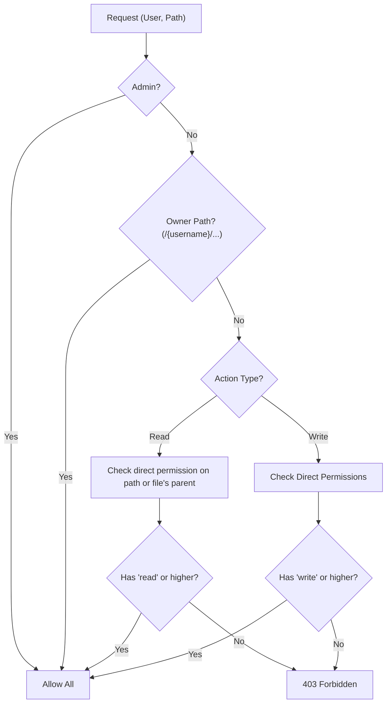
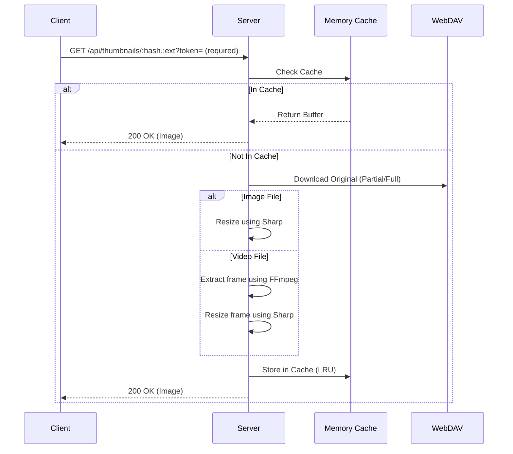
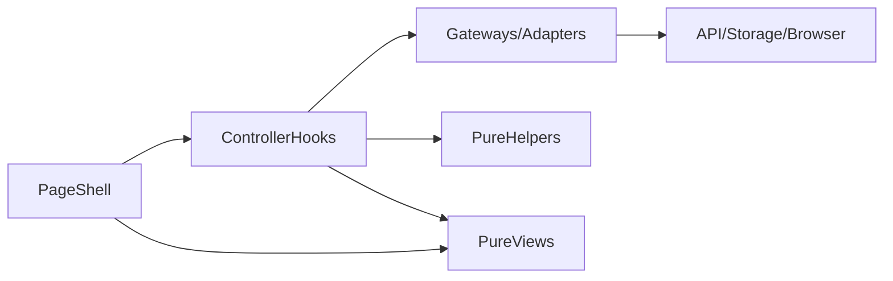

# Architecture Document

## Overview

WebDAV EasyAccess is a **self-hosted, multi-user file management platform** built with a React frontend and Express backend. It adds a modern web interface and fine-grained user/permission management on top of an existing WebDAV server.

## Document Responsibility and Canonical Sources

Use this document for system concepts and flow. Use implementation/runtime contracts from the canonical files below.

| Doc type | Primary responsibility | Out of scope |
|---|---|---|
| `docs/SETUP.md` | Install, run, env keys, migration steps, operational checks | Store-level method contracts and route behavior details |
| `docs/ARCHITECTURE.md` (this doc) | Middleware model, ACL model, data-flow, backend strategy | Full DDL/constraint lists, per-store method matrices |
| `docs/features/*.md` | Product-level behavior and feature intent | Internal table constraints and low-level store internals |
| `docs/spec/server/store/*.md` | Store public methods, error contracts, testable verification scenarios | Long architecture narratives and operator runbooks |

Canonical contract sources:

- Permission enum: `shared/constants.js` (`PERMISSIONS.ALL`)
- PostgreSQL constraints/indexes/tables: `server/store/postgresql/ddl/001_initial_normalized_schema.sql`
- PostgreSQL env keys/runtime parsing: `server/store/storage.js`
- Operator-facing env documentation: `.env.example` and `docs/SETUP.md`

Duplication inventory (this document links instead of repeating full content):

| Repeated topic | Canonical source | Treatment here |
|---|---|---|
| Permission values and ordering | `shared/constants.js`, DDL `permissions_*` checks | Keep one-line model + links |
| Full normalized table constraints/indexes | DDL file | Keep table names and purpose only |
| Migration command sequence | `docs/SETUP.md` | Keep conceptual migration path only |
| API endpoint lists | `docs/api.md` | Replace detailed route list with reference |

---

## 1. Server Architecture

The server follows a **modular monolith** architecture organized into domain-bounded modules and an infrastructure layer. Entry point is `server/index.js`.

### 1.0 Domain-Bounded Structure

Each domain encapsulates its own routes, services, stores, and policy logic under `server/domains/`:

```
server/domains/
├── admin/
│   ├── routes/        # settings.js, users.js, userManagement.js, maintenance.js
│   └── services/      # cleanupService.js, userService.js
├── auth/
│   ├── routes/        # (nested test files)
│   ├── routes.js      # login, register, refresh, me
│   ├── service.js     # auth business logic
│   └── tokenStore.js  # token persistence
├── files/
│   ├── routes/        # crud.js, batch.js, folders.js, preview.js
│   ├── services/      # fileService.js, downloadService.js, selectiveTransfer.js, etc.
│   └── stores/        # operationProgress.js
├── permissions/
│   ├── policy/        # permissionPolicy.js, inheritancePolicy.js, ownerPathResolver.js, permissionRank.js
│   ├── routes/        # index.js, filePermissions.js, folderPermissions.js, queries.js, permissionRequests.js
│   ├── services/      # aclService.js, permissionFacade.js
│   └── stores/        # permissionStore.js, permissionRequestStore.js, permissionExistenceIndex.js
├── recentFiles/
│   ├── routes.js
│   └── service.js
├── sharing/
│   ├── routes/        # shareLinks.js, sharePublic.js
│   └── services/      # shareLinkService.js, shareAccessService.js
└── thumbnails/
    ├── cache.js       # LRU thumbnail cache
    ├── routes/        # thumbnailRoutes.js (public token-based)
    ├── routes.js      # JWT-protected thumbnail endpoints
    └── services/      # imageProcessor.js, videoProcessor.js, thumbnailService.js
```

Domains are mounted in `server/index.js` under their respective API prefixes. Cross-domain dependencies are minimized; shared utilities live in `server/utils/`.

### 1.1 Adapter Layer

The adapter layer sits between domains and physical storage, providing interchangeable backends:

| Adapter | Location | Purpose |
|---------|----------|---------|
| Metadata adapters | `infrastructure/adapters/metadata/` | Abstracts user, permission, settings, share-link, and recent-file persistence. Factory: `createMetadataAdapter()` selects backend via `WEA_STORAGE_BACKEND`. |
| File store adapter | `infrastructure/adapters/filestore/` | Wraps WebDAV file operations behind the `FileStoreAdapter` interface. Default implementation: `WebdavFileStoreAdapter` delegates to `utils/webdav.js`. Factory: `createFileStoreAdapter()`. |
| Cache adapter | `infrastructure/adapters/cache/` | In-memory LRU cache used for client caching, thumbnail storage, etc. Factory: `createCacheAdapter()`. Extensible for Redis in future. |

**Metadata adapter implementations:**
- `PostgresqlMetadataAdapter` — normalized PostgreSQL schema (production default)
- `SqliteMetadataAdapter` — SQLite via better-sqlite3 (development/testing)
- `FsJsonMetadataAdapter` — JSON files under `/.wea/` (legacy WebDAV/filesystem backend)

### 1.2 Infrastructure Layer

Cross-cutting infrastructure modules live in `server/infrastructure/`:

| Module | File | Responsibility |
|--------|------|---------------|
| Lock Manager | `lockManager.js` | Distributed locking for metadata writes. Supports file-based (webdav/fs), PostgreSQL, and SQLite backends with TTL expiry and stale-lock cleanup. Exports `acquireLock()` and `withLock()`. |
| Health Routes | `healthRoutes.js` | Unauthenticated `GET /api/health` endpoint for liveness probes. Mounted at `/api`. |
| WebDAV Routes | `webdavRoutes.js` | Diagnostic endpoints: `GET /api/webdav/test` (connectivity) and `GET /api/webdav/info` (URL display). No auth required. |
| WebDAV Test | `webdavTest.js` | Connection test logic extracted from webdav.js. Creates ephemeral client, probes root directory, returns structured result. |
| SQLite Schema Init | `sqliteSchemaInit.js` | Converts PostgreSQL DDL to SQLite-compatible SQL and executes against the SQLite connection. Used during bootstrap when `WEA_STORAGE_BACKEND=sqlite`. |

### 1.3 Middleware Pipeline

For routes that require it, a standardized middleware chain runs for security and data normalization. Routes such as `/api/health`, `/api/webdav/*`, `/api/share/:token/*`, and `/api/settings/public` do not use Auth, User Loader, Path Normalizer, or Meta Path Guard.

```
Request → CORS → Body Parser → Request Logger → [Auth (JWT) → User Loader → Path Normalizer → Meta Path Guard] (per route) → Route Handler → Error Handler
```

#### Core Middleware
1.  **authenticateToken** (`server/utils/auth.js`): Validates `Authorization: Bearer <JWT>` header and sets `req.user.id`.
2.  **requireUser** (`server/middleware/requireUser.js`): Loads user details from Metadata Store into `req.user.full`.
3.  **normalizePathParam** (`server/middleware/normalizePathParam.js`): Normalizes path-related query and body fields (`path`, `sourcePath`, `destinationPath`, `oldPath`, `folderPath`) to POSIX style and removes duplicate slashes.
4.  **checkMetaPathAccess** (`server/middleware/metaPathGuard.js`): Blocks non-admin access to reserved path `/.wea`.
5.  **errorHandler** (`server/utils/errorHandler.js`): Catches all route errors and returns standardized JSON responses (status, **errorCode**, optional **params**, optional **details** in development).

### 1.4 Permission Policy (ACL)

The system runs its own **ACL (Access Control List)** independent of WebDAV server permissions.



*   **Direct Read**: Read is checked on that folder or the file's direct parent only. No inheritance from ancestor paths.
*   **Direct Write**: Write permission applies only when explicitly granted on that folder (no inheritance).
*   **Owner exception**: `/{username}` is treated as the user's home directory and always grants full access.
*   **Permission enum**: `read < write < admin` (source of truth: `shared/constants.js`; DB enforcement in `server/store/postgresql/ddl/001_initial_normalized_schema.sql`).

---

## 2. Data Structure and Storage

### 2.1 Metadata Store

Metadata storage is selected by `WEA_STORAGE_BACKEND` and keeps the same store API across backends.

*   **Backend selection**:
    *   `webdav` (default): Metadata JSON files under `/.wea` on WebDAV.
    *   `fs`: Metadata JSON files on local server disk.
    *   `postgresql`: Normalized relational schema for metadata and locks.
*   **Interface parity**:
    *   Store public interfaces remain stable across backends.
    *   `userStore`, `permissionStore`, `settingsStore`, `shareLinkStore`, `recentFilesStore`, and `permissionRequestStore` keep the same exported method contracts while using backend-specific persistence.

#### PostgreSQL Normalized Schema

When `WEA_STORAGE_BACKEND=postgresql`, metadata is persisted in normalized tables:
`users`, `settings`, `permissions_user_paths`, `permissions_user_files`, `permissions_shares`,
`share_links`, `recent_files`, `permission_requests`, and `locks`.

This document intentionally omits full constraints/indexes. Treat
`server/store/postgresql/ddl/001_initial_normalized_schema.sql` as the single source of truth.

#### Metadata Migration Path (One-shot)

Legacy file metadata (`webdav`/`fs`) is migrated to normalized PostgreSQL tables through:

- `server/scripts/migrateMetadataToPostgresql.js`

Migration characteristics:

- source backends: `webdav` or `fs` (`/.wea` layout).
- target backend: PostgreSQL normalized schema.
- supports `dry-run` mode (no writes) and `apply` mode (single transaction).
- produces a validation report with source counts, migrated/skipped totals, warnings, and post-write row-count checks.
- command sequence and operator checks are maintained in `docs/SETUP.md`.

#### Storage Layout (Remote/Local)
```
/.wea/
├── users/
│   ├── _index.json      # User ID–username mapping and auto-increment ID
│   └── <username>.json  # User profile, password hash, status, etc. (e.g. admin.json)
├── permissions/
│   ├── users/
│   │   └── <userId>.json   # Per-folder permissions for user (ACL)
│   └── shares/
│       └── <token>.json    # Share-link permission scope
├── index/
│   └── email/
│       └── <hash>.txt   # Reverse index for email deduplication and lookup
├── locks/
│   └── <hash>.lock      # Distributed lock files (concurrency control)
├── share-links/         # Share link metadata (if stored as files)
├── recent-files/        # Per-user recent file lists (if stored as files)
├── permission_requests.json   # Permission request queue
└── settings.json        # Global settings (e.g. signup enabled)
```

### 2.2 Concurrency Control (Metadata Locking)

A **distributed lock** mechanism (`server/store/locks.js`) prevents metadata races across all backends.

*   **webdav/fs**: lock files are created atomically, retried with backoff, and auto-expired via TTL.
*   **postgresql**: lock rows are acquired with `INSERT ... ON CONFLICT` semantics, validated by owner token, and released with TTL-aware cleanup.

#### Transaction Boundaries (PostgreSQL Backend)

For `postgresql`, write paths use explicit transaction boundaries in store-layer operations:

1.  **User lifecycle** (`createUser`, `updateEmail`, `deleteUser`): single transaction including index-equivalent uniqueness and related cleanup.
2.  **Permission mutations** (`grant*`, `revoke*`, rewrite/revoke-prefix): transaction per mutation unit for atomic ACL updates.
3.  **Permission request updates** (`createRequest`, `updateStatus`, bulk reject/delete): single transaction per call with status consistency checks.
4.  **Share link counter update**: `incrementDownloadCount` uses atomic SQL increment (`SET download_count = download_count + 1`) and returns updated row.

#### Canonical Path Rule

Before metadata persistence, paths are normalized to canonical form:

*   POSIX separators and normalized segments
*   trailing slash removed for non-root paths
*   root path preserved as `/`

Comparisons and dedupe logic use canonical paths to keep behavior consistent across backends.

---

## 3. Core File Handling

### 3.1 Thumbnail System

Server-side thumbnails enable fast browsing of media files.



*   **Endpoints**: `GET /api/thumbnails/:hash.:ext` (token in query required) and `GET /api/files/thumbnail/:hash` (JWT) for single thumbnail; `POST /api/files/thumbnails/batch` for batch.
*   **Performance**:
    *   Thumbnails are cached in server memory (max 1000).
    *   Clients request multiple thumbnails in viewport via batch API.
    *   Video thumbnails require FFmpeg; availability is checked once at server startup.

### 3.2 Recursive Operations (Selective Transfer/Delete)

Directory move/delete can be complex depending on WebDAV server behavior. The system uses `selective*` services to handle this.

*   **Flow**:
    1.  Recursively traverse the target folder tree.
    2.  Check **current user ACL** at each step.
    3.  Move/copy/delete only items the user is allowed to access.
    4.  After completion, update or revoke ACL data (`/.wea/permissions/...`) according to new paths.

---

## 4. API Reference Boundary

This document does not duplicate endpoint catalogs.

- Canonical route contracts: `docs/api.md`
- Route-level behavior and error contracts: `docs/spec/server/routes/*.md`

---

## 5. Security and Performance

*   **Security**:
    *   JWT tokens stored only in `sessionStorage` to minimize XSS exposure.
    *   Password change increments `token_version`, invalidating all existing tokens.
    *   Path normalization prevents Directory Traversal attacks.
*   **Performance**:
    *   `asyncLimitSettled` limits concurrent WebDAV requests (e.g. 5–10 per operation).
    *   Permission and user checks are cached in-memory with short TTL (e.g. 3–5s; `PERMISSION_CACHE_TTL_MS`, `USER_CACHE_TTL_MS`).

## 6. Concept Verification Boundary

Use architecture verification for high-level reasoning only:

- middleware chain remains consistent with documented route exclusions
- ACL model preserves owner exception and explicit permission rank behavior
- backend swap (`webdav`/`fs`/`postgresql`) preserves route-level contracts

Detailed executable verification belongs in:

- setup/runtime checks: `docs/SETUP.md`
- store contract scenarios: `docs/spec/server/store/*.md`
- route behavior scenarios: `docs/spec/server/routes/*.md`

---

## 7. Client Architecture (Layering and Boundaries)

This section defines high-level client layering to keep responsibilities explicit and replaceable. Detailed contracts live in client spec docs and feature docs (see references below).

### 7.1 Layers

The client follows a five-layer model:

1. Page shell
   - Owns route composition and product overlays (e.g., share-link mode, virtual collections like `__recent__`, `__shared__`).
   - Composes controller hooks and passes prepared props into views.
   - No direct data-access logic beyond orchestration allowed here.

2. Controller hooks
   - Orchestrate user flows and UI state transitions for a feature area (navigation, commands, progress, dialogs).
   - Coordinate gateways and helpers; expose callbacks and view models to views.
   - Must not import browser globals or services directly; all IO via gateways/adapters.

3. Gateways / adapters
   - Isolate IO: HTTP/API calls, storage access, and browser APIs.
   - Provide narrow, testable interfaces consumed by controller hooks.
   - Are the only layer allowed to depend on transport, token storage, or Web APIs.

4. Pure helpers
   - Pure functions that hold domain rules and derived state logic.
   - No side effects, no IO, no React state.

5. Pure views
   - React components that render strictly from props.
   - No service, storage, router, or browser API imports.
   - May receive callbacks and prepared data from controller hooks only.

High-level flow:



### 7.2 Feature boundaries

- Explorer core vs product overlays
  - Explorer core handles listing, selection, navigation, commands, and progress.
  - Product overlays (e.g., share-link mode, virtual collections like `__recent__`, `__shared__`, admin-only visibility) live in page shells or dedicated controllers outside explorer core.

- Tree and picker ecosystem
  - Tree/picker views are pure; expansion rules, lazy loading, and target validation live in controllers and helpers.
  - Data access (listing folders, shared folders) goes through folder gateways.

- Auth/session
  - Transport, token storage, and auth navigation policy are separated behind dedicated adapters.
  - UI pages (Login/Register/MyPage) are page shells that compose controller hooks and views.

### 7.3 Hard constraints

- Pure views do not import services, storage utilities, router hooks, or browser globals.
- Browser APIs and storage access are hidden behind adapters (gateways), never called directly from views/controllers without going through the gateway boundary.
- Controller hooks own orchestration, not low-level IO; they depend on gateways and helpers.
- Do not merge product-specific rules into reusable explorer core modules.
- Structural refactors must update the corresponding client specs before source changes.

### 7.4 Canonical references

Use these docs for client contracts and feature intent (do not duplicate details here):

- Client specs: `docs/spec/client/**/*` (pages, hooks, services, components, utils)
- Feature docs: `docs/features/*.md` (product behavior and overlays)
- Coding style and layering rules: `docs/CODING_STYLE.md`

The architecture document establishes boundaries and points to canonical specs to avoid drift and duplication.
