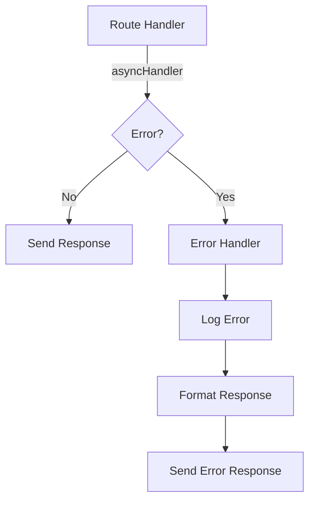
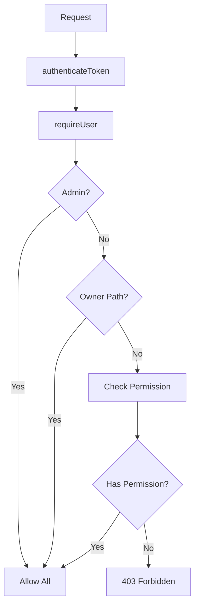
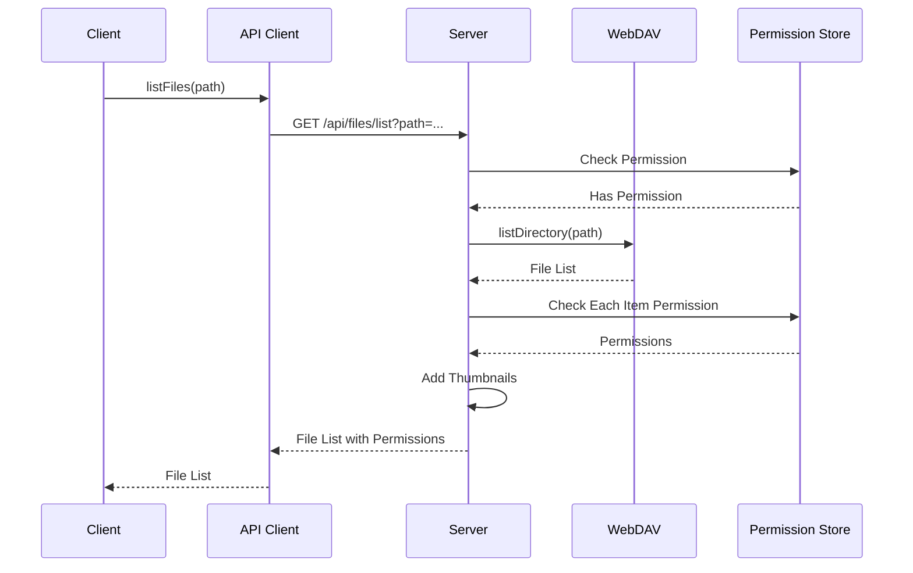
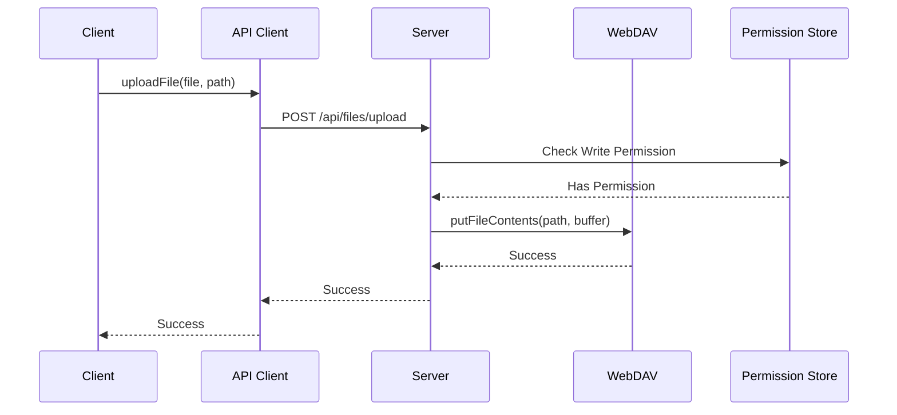
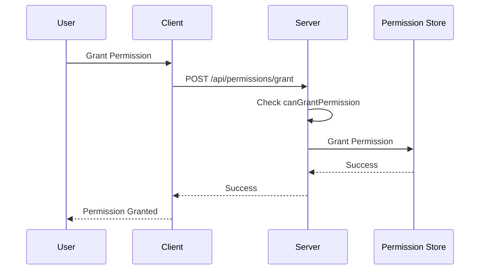

# 아키텍처 문서

## 개요

WebDAV EasyAccess는 React 프론트엔드와 Express 백엔드로 구성된 파일 관리 시스템입니다. 이 문서는 주요 아키텍처 패턴과 데이터 플로우를 설명합니다.

## 서버 아키텍처

### 미들웨어 구조

서버는 다음 순서로 미들웨어를 적용합니다:

```
Request → CORS → Body Parser → Request Logger → Routes → Error Handler
```

#### 주요 미들웨어

1. **authenticateToken** (`server/utils/auth.js`)
   - JWT 토큰 검증
   - `req.user`에 사용자 ID 설정

2. **requireUser** (`server/middleware/requireUser.js`)
   - 전체 사용자 객체를 `req.user.full`에 로드
   - 모든 인증된 라우트에서 사용자 정보 접근 간소화

3. **normalizePathParam** (`server/middleware/normalizePathParam.js`)
   - 경로 파라미터 자동 정규화
   - `req.query.path`, `req.body.path` 등을 정규화

4. **checkMetaPathAccess** (`server/middleware/metaPathGuard.js`)
   - 메타 경로(`/.wea`) 접근 제어
   - 관리자만 접근 허용

5. **errorHandler** (`server/utils/errorHandler.js`)
   - 모든 라우트 에러를 중앙에서 처리
   - 표준화된 에러 응답 포맷

### 에러 처리 플로우



#### 에러 처리 패턴

1. **asyncHandler 래퍼**
   ```javascript
   router.get('/path', asyncHandler(async (req, res) => {
     // 에러가 자동으로 catch되어 errorHandler로 전달됨
     const data = await someAsyncOperation();
     res.json(data);
   }));
   ```

2. **에러 생성 헬퍼**
   ```javascript
   throw validationError('Invalid input');
   throw forbiddenError('Access denied');
   throw notFoundError('Resource not found');
   ```

3. **에러 핸들러**
   - 모든 에러를 표준 포맷으로 변환
   - 개발 환경에서만 스택 트레이스 포함
   - 적절한 HTTP 상태 코드 설정

### 권한 체크 플로우



#### 권한 정책

1. **읽기 권한 (Read)**
   - 상위 경로 권한 상속 (effective/inherited)
   - 부모 폴더에 읽기 권한이 있으면 하위 폴더 접근 가능

2. **쓰기 권한 (Write)**
   - 직접 권한만 인정 (direct-only)
   - 상위 경로 권한 상속 없음
   - 공유 폴더는 직접 권한 필요

3. **소유자 예외**
   - `/{username}` 경로는 항상 읽기/쓰기 가능
   - 하위 경로도 자동으로 소유자 권한 적용

4. **관리자 예외**
   - 관리자는 모든 경로에 접근 가능
   - 권한 체크 건너뛰기

#### 권한 체크 헬퍼 함수

- `canReadFolder(userId, folderPath)` - 폴더 읽기 권한 체크
- `canWriteFolder(user, folderPath)` - 폴더 쓰기 권한 체크
- `canGrantPermission(user, folderPath, userId)` - 권한 부여 권한 체크
- `canRevokePermission(user, folderPath, userId, targetUserId)` - 권한 취소 권한 체크
- `canViewPermissions(user, folderPath, userId)` - 권한 조회 권한 체크

### 라우트 구조

모든 라우트는 다음 패턴을 따릅니다:

```javascript
router.METHOD('/path', 
  authenticateToken,      // 1. 인증
  requireUser,            // 2. 사용자 로드
  normalizePathParam,     // 3. 경로 정규화
  checkMetaPathAccess,    // 4. 메타 경로 체크 (필요시)
  asyncHandler(async (req, res) => {
    // 5. 비즈니스 로직
    const user = req.user.full; // 사용자 정보
    // ...
    res.json(result);
  })
);
```

## 클라이언트 아키텍처

### 상태 관리 패턴

#### Context API
- `AuthContext`: 인증 상태 관리
- JWT 토큰을 sessionStorage에 저장

#### Custom Hooks

1. **useFileManager**
   - 파일 목록 관리
   - 정렬, 필터링
   - 경로 네비게이션

2. **useFileOperations**
   - 단일 파일 작업 (다운로드, 이름변경, 삭제, 이동, 복사)
   - 진행 상태 관리

3. **useBulkOperations**
   - 다중 파일 작업
   - 일괄 삭제, 다운로드, 이동, 복사

4. **useFileOperationProgress**
   - 진행 상태 중앙 관리
   - 에러 처리 통합
   - 재시도 로직

5. **useMessage**
   - 통합 메시지 표시
   - 성공/에러/경고 메시지

6. **useFormState**
   - 폼 상태 관리
   - 유효성 검사 통합

### API 클라이언트

#### 구조

```javascript
import { get, post, put, del } from './services/apiClient';

// 자동 토큰 주입
// 자동 에러 처리
// 재시도 로직
```

#### 인터셉터

1. **Request Interceptor**
   - sessionStorage에서 토큰 읽기
   - Authorization 헤더 자동 추가

2. **Response Interceptor**
   - 401 에러: 자동 로그아웃 및 리다이렉트
   - 403 에러: 에러 메시지 표시
   - 네트워크 에러: 사용자 친화적 메시지

### 컴포넌트 구조

#### BaseDialog
모든 다이얼로그의 기본 컴포넌트:
- 반응형 레이아웃 (모바일에서 fullScreen)
- 표준화된 구조 (Title, Content, Actions)

#### 파일 작업 진행
- `FileOperationProgress`: 진행 상태 표시 컴포넌트
- `useFileOperationProgress`: 진행 상태 관리 훅

## 데이터 플로우

### 파일 목록 조회



### 파일 업로드



### 권한 부여



## 보안 고려사항

### 인증
- JWT 토큰 기반 인증
- sessionStorage 저장 (브라우저 종료 시 자동 로그아웃)
- 토큰 만료 시 자동 로그아웃

### 권한
- 경로 기반 권한 체크
- 메타 경로(`/.wea`)는 관리자만 접근
- 소유자 경로는 항상 접근 가능

### 입력 검증
- 경로 정규화로 경로 조작 방지
- 파일명 유효성 검사
- SQL 인젝션 방지 (NoSQL 사용)

## 성능 최적화

### 서버
- WebDAV 클라이언트 캐싱
- 썸네일 캐싱
- 비동기 작업 진행 상태 추적

### 클라이언트
- React.memo로 불필요한 리렌더링 방지
- 가상화된 리스트 (react-virtualized)
- 이미지/비디오 지연 로딩

## 확장성

### 미들웨어 추가
새로운 미들웨어는 `server/middleware/`에 추가하고 라우트에 적용:

```javascript
const myMiddleware = require('../middleware/myMiddleware');
router.get('/path', authenticateToken, myMiddleware, handler);
```

### 새로운 권한 체크
`server/utils/permissionPolicy.js`에 헬퍼 함수 추가:

```javascript
async function canDoSomething(user, path, userId) {
  // 권한 체크 로직
}
```

### 새로운 API 엔드포인트
1. `server/routes/`에 새 라우트 파일 생성
2. `server/index.js`에 등록
3. `asyncHandler`, `requireUser` 등 미들웨어 사용

## 테스트 전략

### 단위 테스트
- 유틸리티 함수
- 권한 정책 함수
- 모델 메서드

### 통합 테스트
- 라우트 핸들러
- 미들웨어 체인
- WebDAV 연동

### E2E 테스트
- 파일 업로드/다운로드
- 권한 부여/취소
- 사용자 승인 플로우
