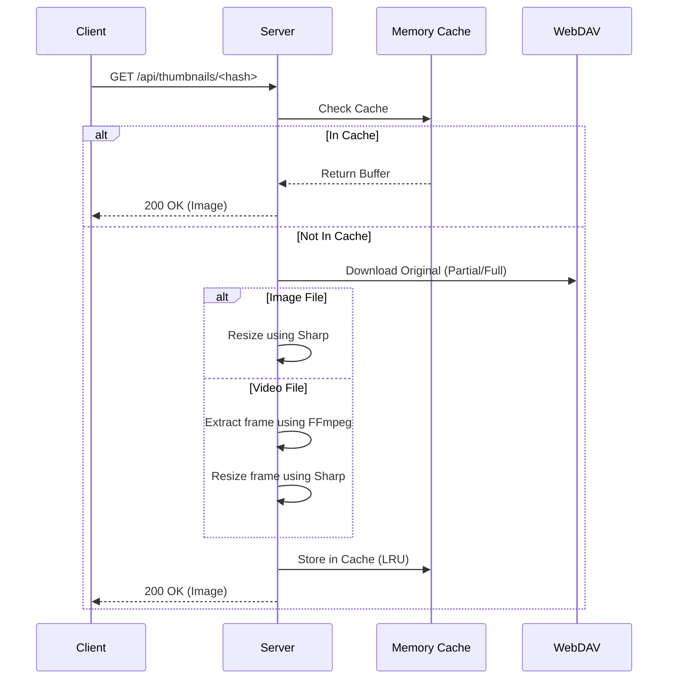

# Architecture Document

## Overview

WebDAV EasyAccess is a **self-hosted, multi-user file management platform** built with a React frontend and Express backend. It adds a modern web interface and fine-grained user/permission management on top of an existing WebDAV server.

---

## 1. Server Architecture

### 1.1 Middleware Pipeline

All API requests pass through a standardized middleware chain for security and data normalization:

```
Request → CORS → Body Parser → Request Logger → Auth (JWT) → User Loader → Path Normalizer → Meta Path Guard → Route Handler → Error Handler
```

#### Core Middleware
1.  **authenticateToken** (`server/utils/auth.js`): Validates `Authorization: Bearer <JWT>` header and sets `req.user.id`.
2.  **requireUser** (`server/middleware/requireUser.js`): Loads user details from Metadata Store into `req.user.full`.
3.  **normalizePathParam** (`server/middleware/normalizePathParam.js`): Normalizes request `path` to POSIX style and removes duplicate slashes.
4.  **checkMetaPathAccess** (`server/middleware/metaPathGuard.js`): Blocks non-admin access to reserved path `/.wea`.
5.  **errorHandler** (`server/utils/errorHandler.js`): Catches all route errors and returns standardized JSON responses (status, error, message).

### 1.2 Permission Policy (ACL)

The system runs its own **ACL (Access Control List)** independent of WebDAV server permissions.


*   **Inherited Read**: If a user has permission on a parent folder, they can access all children.
*   **Direct Write**: Write permission applies only when explicitly granted on that folder (no inheritance).
*   **Owner exception**: `/{username}` is treated as the user's home directory and always grants full access.

---

## 2. Data Structure and Storage

### 2.1 Metadata Store

Instead of a dedicated database (MySQL, MongoDB, etc.), the system uses **JSON-based file storage** so it can run entirely on a WebDAV server.

*   **Backend selection**: Controlled by `WEA_STORAGE_BACKEND` in `.env`.
    *   `webdav` (default): Stored under `/.wea` on the WebDAV server. (Enables full statelessness)
    *   `fs`: Stored on the server's local filesystem. (Better performance)

#### Storage Layout (Remote/Local)
```
/.wea/
├── users/
│   ├── _index.json      # User ID–username mapping and auto-increment ID
│   └── user1.json       # User profile, password hash, status, etc.
├── permissions/
│   └── users/
│       └── 1.json       # Per-folder permissions for user ID 1 (ACL)
├── index/
│   └── email/
│       └── <hash>.txt   # Reverse index for email deduplication and lookup
├── locks/
│   └── <hash>.lock      # Distributed lock files (concurrency control)
└── settings.json        # Global settings (e.g. signup enabled)
```

### 2.2 Concurrency Control (Metadata Locking)

A **distributed lock** mechanism (`server/store/locks.js`) prevents data loss when multiple users modify metadata concurrently.

1.  Attempts atomic file creation via WebDAV `If-None-Match: *` header.
2.  On success, lock is acquired; on failure, waits and retries.
3.  TTL stored in lock files auto-releases locks after server failures.

---

## 3. Core File Handling

### 3.1 Thumbnail System

Server-side thumbnails enable fast browsing of media files.



*   **Performance**:
    *   Thumbnails are cached in server memory (max 1000).
    *   Clients request multiple thumbnails in viewport via batch API.
    *   Video thumbnails require FFmpeg; availability is checked once at server startup.

### 3.2 Recursive Operations (Selective Transfer/Delete)

Directory move/delete can be complex depending on WebDAV server behavior. The system uses `selective*` services to handle this.

*   **Flow**:
    1.  Recursively traverse the target folder tree.
    2.  Check **current user ACL** at each step.
    3.  Move/copy/delete only items the user is allowed to access.
    4.  After completion, update or revoke ACL data (`/.wea/permissions/...`) according to new paths.

---

## 4. API Guide (Summary)

### 4.1 Auth
*   `POST /api/auth/login`: Login and issue token.
*   `POST /api/auth/register`: Sign up.
*   `POST /api/auth/refresh`: Refresh token.
*   `GET /api/auth/me`: Current user info (requires auth).

### 4.2 Files and Folders
*   `GET /api/files/list?path=...`: List folder contents (includes ACL info).
*   `GET /api/files/download?path=...`: Download single file.
*   `POST /api/files/upload`: Upload file (checks parent write permission).
*   `PUT /api/files/rename`: Rename file or folder.
*   `POST /api/files/batch-move`: Move multiple items (with ACL updates).
*   `POST /api/files/batch-copy`: Copy multiple items.
*   `POST /api/files/batch-delete`: Delete multiple items.
*   `POST /api/files/download-multiple`: ZIP download for multiple files/folders.
*   `GET /api/files/operation-progress/:id`: Bulk operation progress.
*   `POST /api/files/bulk-operation/:jobId/cancel`: Cancel bulk operation.
*   `GET /api/files/thumbnail/:hash`, `POST /api/files/thumbnails/batch`: Thumbnail requests.
*   `POST /api/files/check-conflicts`: Check for name conflicts before paste.
*   `POST /api/files/metadata`: Get file metadata.
*   `POST /api/folders/create`: Create folder.

### 4.3 Permissions
*   `POST /api/permissions/grant`: Grant folder permission to another user.
*   `DELETE /api/permissions/revoke`: Revoke permission.
*   `GET /api/permissions/user/:userId`: List permissions for a user.
*   `GET /api/permissions/folder?path=...`: List permissions for a folder.
*   `GET /api/permissions/check?path=...`: Check current user permission.
*   `POST /api/permissions/file/grant`, `DELETE /api/permissions/file/revoke`, `PATCH /api/permissions/file`: File-level permission APIs.
*   `GET /api/permissions/file/check`, `GET /api/permissions/file/list`: File permission checks.

### 4.4 Permission Requests
*   `POST /api/permission-requests`: Create permission request (user requests access from owner).
*   `GET /api/permission-requests/inbox`: List incoming requests (for owners).
*   `GET /api/permission-requests/outbox`: List outgoing requests (for requesters).
*   `GET /api/permission-requests/check-owner?path=...`: Check if path has an owner for requests.
*   `POST /api/permission-requests/:id/approve`: Approve request (owner).
*   `POST /api/permission-requests/:id/reject`: Reject request (owner).
*   `POST /api/permission-requests/:id/cancel`: Cancel own request (requester).

### 4.5 Share Links (External)
*   `POST /api/share-links`: Create share link (authenticated).
*   `GET /api/share-links`: List own share links.
*   `GET /api/share-links/:token`: Get share link details.
*   `PUT /api/share-links/:token`: Update (e.g. expiry).
*   `DELETE /api/share-links/:token`: Delete share link.
*   `GET /api/share/:token/info`: Public: get share link info (no auth).
*   `GET /api/share/:token`: Public: download file.
*   `GET /api/share/:token/preview`: Public: preview file.
*   `GET /api/share/:token/check-my-permission`: Check if current user has access (auth).
*   `POST /api/share/:token/add-to-my-permissions`: Add shared item to current user's permissions (auth).

### 4.6 Recent Files
*   `GET /api/recent-files`: List recent files for current user.
*   `POST /api/recent-files`: Add file to recent list.
*   `DELETE /api/recent-files/:filePath`: Remove from recent list.
*   `DELETE /api/recent-files`: Clear all recent files.
*   `POST /api/recent-files/apply-moves`: Update paths after bulk move.
*   `POST /api/recent-files/remove-paths`: Remove paths after delete.

### 4.7 Health and Diagnostics
*   `GET /api/health`: Health check (returns `{ status: "ok" }`).
*   `GET /api/webdav/test`: Test WebDAV connection.

### 4.8 Admin
*   `GET /api/admin/settings`, `PUT /api/admin/settings`: System settings.
*   `GET /api/admin/users/pending`: Pending signup approvals.
*   `GET /api/admin/users`, `POST /api/admin/users`: List/add users.
*   `POST /api/admin/users/:id/approve`, `POST /api/admin/users/:id/reject`: Approve/reject signups.
*   `DELETE /api/admin/users/:id`: Delete user.
*   `GET /api/admin/folders/list`: List folders for admin permission management.
*   `PUT /api/admin/users/:id/permissions`: Set user folder permissions.
*   `POST /api/admin/permissions/ensure-home-owner-admin`: Ensure home folder owner has admin.
*   `POST /api/admin/cleanup/orphaned`: Clean orphaned metadata.

### 4.9 Users and Settings
*   `GET /api/users`, `GET /api/users/approved`, `GET /api/users/:id`: User listing and profile.
*   `PUT /api/users/:id/password`, `PUT /api/users/:id/email`, `PUT /api/users/:id/permissions`: Update user.
*   `GET /api/settings/public`: Public settings (e.g. signup enabled).

---

## 5. Security and Performance

*   **Security**:
    *   JWT tokens stored only in `sessionStorage` to minimize XSS exposure.
    *   Password change increments `token_version`, invalidating all existing tokens.
    *   Path normalization prevents Directory Traversal attacks.
*   **Performance**:
    *   `asyncLimitSettled` limits concurrent WebDAV requests (default 5–10).
    *   Frequent permission checks are cached in-memory with short TTL (1s).
