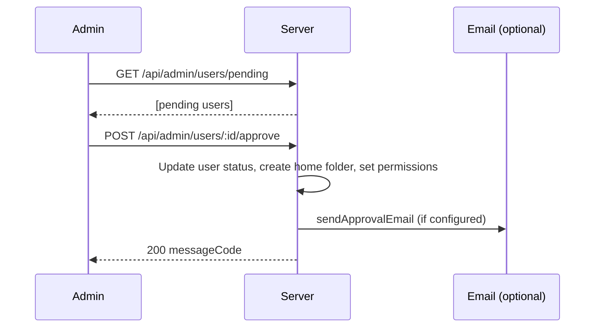

# Admin and Infrastructure

This document describes the admin role and APIs, health and WebDAV diagnostics, the per-route middleware pipeline, metadata store layout, and metadata locking. Use it with [api.md](../api.md) and [ARCHITECTURE.md](../ARCHITECTURE.md).

---

## Overview

Administrators are users with `is_admin` set. All admin routes require a valid JWT and the `isAdmin` check (middleware that loads the user and verifies `user.is_admin`). Non-admin callers receive 403. Admin capabilities include system settings (e.g. signup enabled), approving or rejecting signups (with optional email notifications), user and permission management, and cleanup of orphaned metadata. Health and WebDAV endpoints are unauthenticated and used for monitoring and UI. The server uses a per-route middleware chain (Auth → User Loader → Path Normalizer → Meta Path Guard) and a distributed lock over the metadata store for concurrency control.

---

## Specification

### Admin role and middleware

- **isAdmin:** Determined by `user.is_admin` (from metadata store). Stored in JWT payload for quick checks; admin routes re-load user and enforce `is_admin`.
- **Admin middleware:** In `server/routes/admin.js`, `isAdmin` loads the user by `req.user.id` and returns 403 with `errorCode: admin.adminRequired` if not admin. All admin routes use `authenticateToken` then `isAdmin`.

### Admin APIs

| Area | Endpoints | Description |
|------|-----------|-------------|
| Settings | `GET /api/admin/settings`, `PUT /api/admin/settings` | Get/update system settings (e.g. `registration_enabled`). |
| Users | `GET /api/admin/users/pending`, `GET /api/admin/users`, `POST /api/admin/users` | Pending signups, list all users, add user. |
| Approval | `POST /api/admin/users/:id/approve`, `POST /api/admin/users/:id/reject` | Approve or reject signup; optional email (sendApprovalEmail, sendRejectionEmail). |
| User management | `DELETE /api/admin/users/:id` | Delete user (cannot delete self or other admins). |
| Permissions | `GET /api/admin/folders/list`, `PUT /api/admin/users/:id/permissions` | List folders for permission UI; set user folder permissions. |
| Cleanup | `POST /api/admin/permissions/ensure-home-owner-admin`, `POST /api/admin/cleanup/orphaned` | Ensure home owner has admin on home folder; clean orphaned metadata. |

See [api.md](../api.md) for exact methods, paths, and bodies.

### Health and WebDAV diagnostics

- **GET /api/health** — No auth. Returns e.g. `{ status: "ok", messageCode }`. Used for liveness/monitoring.
- **GET /api/webdav/test** — No auth. Tests WebDAV connectivity.
- **GET /api/webdav/info** — No auth. Returns WebDAV URL info (e.g. for UI display).

These routes do **not** use the Auth, User Loader, Path Normalizer, or Meta Path Guard middleware (see ARCHITECTURE §1.1).

### Per-route middleware pipeline

For routes that require it:

```
Request → CORS → Body Parser → Request Logger → [Auth (JWT) → User Loader → Path Normalizer → Meta Path Guard] (per route) → Route Handler → Error Handler
```

- **Auth:** `authenticateToken` validates `Authorization: Bearer <JWT>`, sets `req.user.id`.
- **User Loader:** `requireUser` loads full user from metadata store into `req.user.full`.
- **Path Normalizer:** `normalizePathParam` normalizes path-related query/body fields to POSIX style.
- **Meta Path Guard:** `checkMetaPathAccess` blocks non-admin access to reserved path `/.wea` (and in share context, blocks paths outside share root).

Routes like `/api/health`, `/api/webdav/*`, `/api/share/:token/*`, and `/api/settings/public` do not use the auth chain.

### Metadata store and locking

- **Storage layout:** See ARCHITECTURE §2.1. Under `/.wea/`: users, permissions (users + shares), index/email, locks, share-links, recent-files, permission_requests, settings. Backend selected by `WEA_STORAGE_BACKEND` (`webdav` or `fs`).
- **Locking:** `server/store/locks.js` provides distributed locks (e.g. `acquireLock(lockName, options)`). Lock files created on WebDAV/FS with `If-None-Match: *`; TTL in lock file for auto-release. Used for metadata updates to prevent concurrent write corruption.

---

## Flows

### Admin: signup approval and email



Reject flow: `POST /api/admin/users/:id/reject`; optional `sendRejectionEmail`.

### Admin: user permissions and cleanup

- **Set permissions:** Admin calls `PUT /api/admin/users/:id/permissions` with body containing permission list; server updates `/.wea/permissions/users/<userId>.json`.
- **Ensure home owner admin:** `POST /api/admin/permissions/ensure-home-owner-admin` ensures each user’s home folder has that user as admin (e.g. after recovery).
- **Orphan cleanup:** `POST /api/admin/cleanup/orphaned` removes orphaned metadata (e.g. permissions/shares pointing to missing paths); response includes result summary.

### API pipeline and meta path

- Authenticated file/folder request: Auth → User Loader → Normalize path params → If path is `/.wea`, Meta Path Guard allows only when `user.is_admin`; otherwise 403. Then route handler runs (and may perform further ACL checks per [permissions.md](permissions.md)).

### Metadata lock usage

- Before updating shared metadata (e.g. user index, permissions, settings), server acquires a lock by name (e.g. `users-index`, `perm:${userId}`). On success, performs read-modify-write then releases lock. On failure (e.g. timeout), returns error. TTL in lock file allows recovery after server crash.

---

## Testing

When implementing or reviewing tests for admin and infrastructure, cover at least:

- **Non-admin 403:** Authenticated non-admin calling any admin route (e.g. `GET /api/admin/settings`, `POST /api/admin/users/:id/approve`) receives 403 with `errorCode` for admin required.
- **Approve/reject and email:** Approve sets user to approved, creates home folder/permissions as designed; reject sets status to rejected. If email is configured, sending is stubbed or asserted in tests.
- **Cleanup:** Orphan cleanup returns expected shape (e.g. removed count or list); no side effects on valid metadata.
- **Health and WebDAV:** `GET /api/health` returns 200 and `status: "ok"`; `GET /api/webdav/test` and `GET /api/webdav/info` return expected response format without auth.
- **Meta path:** Request with path `/.wea` or body containing `/.wea` as source/destination returns 403 for non-admin; admin can access as allowed by route.

Use [TESTING_STRATEGY.md](../TESTING_STRATEGY.md) for integration vs unit and mocking (e.g. test JWT with `is_admin` for server admin tests).
