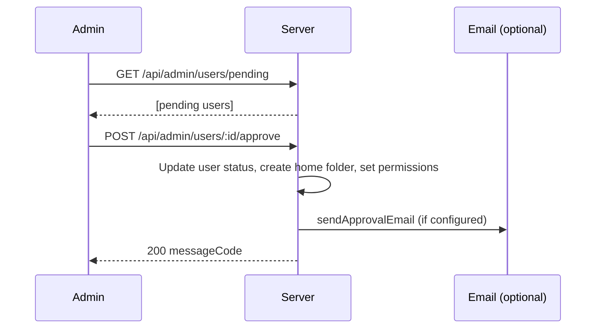

# Admin and Infrastructure

This feature document focuses on admin-facing behavior and operational intent. For implementation contracts, use:

- route contracts: `docs/spec/server/routes/*.md`
- middleware/data-flow architecture: `docs/ARCHITECTURE.md`
- setup/migration/env operations: `docs/SETUP.md`
- metadata schema constraints: `server/store/postgresql/ddl/001_initial_normalized_schema.sql`

---

## Overview

Administrators are users with `is_admin` set. Admin routes require a valid JWT and admin authorization; non-admin callers receive 403. Admin capabilities include settings management, signup approval/rejection (optionally with email notifications), user lifecycle controls, ACL maintenance, and cleanup operations. Health and WebDAV diagnostic endpoints are unauthenticated and remain available for monitoring/UI checks.

---

## Specification

### Admin role and middleware

- **isAdmin:** Determined by `user.is_admin` (from metadata store). Stored in JWT payload for quick checks; admin routes re-load user and enforce `is_admin`.
- **Admin middleware:** In `server/routes/admin.js`, `isAdmin` loads the user by `req.user.id` and returns 403 with `errorCode: admin.adminRequired` if not admin. All admin routes use `authenticateToken` then `isAdmin`.
- **Pipeline boundary:** Full middleware ordering and exclusions are documented in `docs/ARCHITECTURE.md` and are not duplicated here.

### Admin APIs

| Area | Endpoints | Description |
|------|-----------|-------------|
| Settings | `GET /api/admin/settings`, `PUT /api/admin/settings` | Get/update system settings (e.g. `registration_enabled`). |
| Users | `GET /api/admin/users/pending`, `GET /api/admin/users`, `POST /api/admin/users` | Pending signups, list all users, add user. |
| Approval | `POST /api/admin/users/:id/approve`, `POST /api/admin/users/:id/reject` | Approve or reject signup; optional email (sendApprovalEmail, sendRejectionEmail). |
| User management | `DELETE /api/admin/users/:id` | Delete user (cannot delete self or other admins). |
| Permissions | `GET /api/admin/folders/list`, `PUT /api/admin/users/:id/permissions` | List folders for permission UI; set user folder permissions. |
| Cleanup | `POST /api/admin/permissions/ensure-home-owner-admin`, `POST /api/admin/cleanup/orphaned` | Ensure home owner has admin on home folder; clean orphaned metadata. |

See [api.md](../api.md) for exact methods, paths, and bodies.

### Health and WebDAV diagnostics

- **GET /api/health** — No auth. Returns e.g. `{ status: "ok", messageCode }`. Used for liveness/monitoring.
- **GET /api/webdav/test** — No auth. Tests WebDAV connectivity.
- **GET /api/webdav/info** — No auth. Returns WebDAV URL info (e.g. for UI display).

These routes bypass the authenticated middleware chain (see `docs/ARCHITECTURE.md`).

### Per-route middleware pipeline

Canonical middleware flow, middleware responsibilities, and route exclusions are documented in `docs/ARCHITECTURE.md`.

### Metadata store and locking

- **Storage backend selection:** `WEA_STORAGE_BACKEND` (`webdav`, `fs`, `postgresql`) with stable store interfaces across backends.
- **Canonical schema/constraints:** `server/store/postgresql/ddl/001_initial_normalized_schema.sql`.
- **Canonical env/runtime parser:** `server/store/storage.js`.
- **Locking contract:** `server/store/locks.js` (backend-specific lock implementation; feature-level guarantee is race-safe metadata writes).
- **Migration workflow:** `server/scripts/migrateMetadataToPostgresql.js` command usage and order are documented in `docs/SETUP.md`.

---

## Flows

### Admin: signup approval and email

Reject flow: `POST /api/admin/users/:id/reject`; optional `sendRejectionEmail`.

### Admin: user permissions and cleanup

- **Set permissions:** Admin calls `PUT /api/admin/users/:id/permissions` with body containing permission list; server updates `/.wea/permissions/users/<userId>.json`.
- **Ensure home owner admin:** `POST /api/admin/permissions/ensure-home-owner-admin` ensures each user’s home folder has that user as admin (e.g. after recovery).
- **Orphan cleanup:** `POST /api/admin/cleanup/orphaned` removes orphaned metadata (e.g. permissions/shares pointing to missing paths); response includes result summary.

### API pipeline and meta path

- Authenticated file/folder request: Auth → User Loader → Normalize path params → If path is `/.wea`, Meta Path Guard allows only when `user.is_admin`; otherwise 403. Then route handler runs (and may perform further ACL checks per [permissions.md](permissions.md)).

### Metadata lock usage

- Before updating shared metadata (e.g. user index, permissions, settings), server acquires a lock by name (e.g. `users-index`, `perm:${userId}`). On success, performs read-modify-write then releases lock. On failure (e.g. timeout), returns error. TTL in lock file allows recovery after server crash.

---

## Testing

Feature-level verification scope (behavioral outcomes):

For the complete browser-flow inventory and rollout plan for admin-facing UI coverage, see [../E2E_COVERAGE_PLAN.md](../E2E_COVERAGE_PLAN.md). Keep this feature doc focused on behavior and operational intent rather than a full E2E checklist.

- **Non-admin 403:** Authenticated non-admin calling any admin route (e.g. `GET /api/admin/settings`, `POST /api/admin/users/:id/approve`) receives 403 with `errorCode` for admin required.
- **Approve/reject and email:** Approve sets user to approved and prepares expected initial access; reject sets status to rejected. If email is configured, notification side effects are validated.
- **Cleanup:** Orphan cleanup returns expected shape (e.g. removed count or list); no side effects on valid metadata.
- **Health and WebDAV:** `GET /api/health` returns 200 and `status: "ok"`; `GET /api/webdav/test` and `GET /api/webdav/info` return expected response format without auth.
- **Meta path guard:** Requests touching reserved metadata paths are blocked for non-admin callers.

Detailed store-level and route-level verification matrices belong in `docs/spec/server/store/*.md`
and `docs/spec/server/routes/*.md`. Use [TESTING_STRATEGY.md](../TESTING_STRATEGY.md) for test design.
