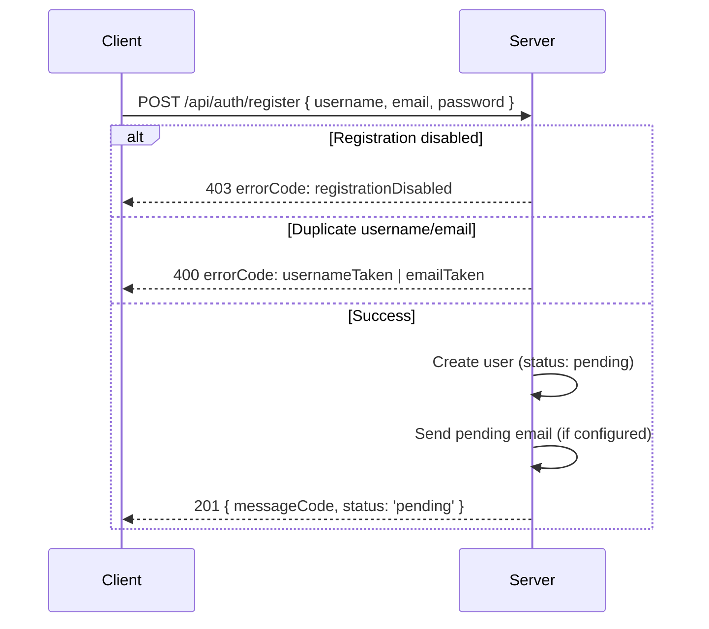
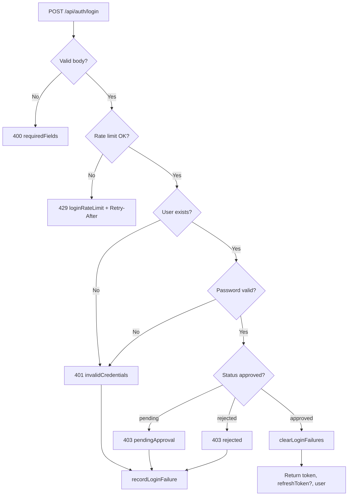

# Auth, Users, and Public Settings

This document describes authentication (register, login, refresh, me), user management APIs (list, approved, profile, password/email/permissions), and public settings. Use it together with [api.md](../api.md) and [shared-contracts.md](../shared-contracts.md).

---

## Overview

The application uses JWT-based authentication. Users sign up (when registration is enabled), wait for admin approval, then log in to receive an access token (and optional refresh token). Tokens are stored in **sessionStorage** so that closing the browser logs the user out. The `/api/auth/me` endpoint provides the current user; user APIs allow listing users (e.g. for share dialogs), changing one's own password/email, and managing one's own permissions. Public settings (e.g. signup enabled) are exposed without authentication for the login/register UI.

---

## Specification

### Auth APIs

| Endpoint | Method | Auth | Input | Output / Notes |
|----------|--------|------|-------|----------------|
| `/api/auth/register` | POST | None | `username`, `email`, `password` | On success: `{ messageCode, status: 'pending' }` or `{ token, refreshToken?, user }` if auto-approved. Duplicate username/email → 400 with `errorCode`. Registration disabled → 403. |
| `/api/auth/login` | POST | None | `username`, `password` | Returns `{ user, token, refreshToken? }`. Rate limited (429); pending/rejected status → 403 with `errorCode`. |
| `/api/auth/refresh` | POST | None | `refreshToken` (body) | Returns `{ token }`. Invalid/expired refresh → 401. |
| `/api/auth/me` | GET | Token | — | Returns current user object. 401 if invalid/expired. |

**Input rules (validation):**

- Username, email, password: required on register/login where applicable. Validation uses `shared/validation.js` (e.g. `validateUsername`, `validateEmail`, `validatePassword`). Server returns 400 with appropriate `errorCode` for invalid input.
- Passwords: minimum/maximum length enforced; password change requires `currentPassword` and `newPassword`.

**Rate limit (login):**

- In-memory, per-process. Keyed by client IP (or `X-Forwarded-For`).
- Env: `LOGIN_RATE_LIMIT_WINDOW_MS` (default 15m), `LOGIN_RATE_LIMIT_MAX` (default 20).
- When exceeded: 429 with `errorCode` (e.g. `serverErrors.auth.loginRateLimit`), `Retry-After` header.

**Session storage:**

- Client stores `token` (and optionally `refreshToken`) in **sessionStorage** only. No localStorage for auth (legacy cleanup removes it). 401: 인증 실패 → refresh 시도 후 실패 시 logout, `/login` 리다이렉트. 403: 인가 실패 → URL 이동 직후(list, admin 등)는 `history.back()` 또는 `/`, 그 외는 리다이렉트 없음 (에러 전파).

### User APIs

| Endpoint | Method | Auth | Description |
|----------|--------|------|-------------|
| `/api/users` | GET | Token | List users (e.g. for share dialogs). |
| `/api/users/approved` | GET | Token | List approved users only. |
| `/api/users/:id` | GET | Token | Get user by id. |
| `/api/users/:id/password` | PUT | Token | Change password. Body: `currentPassword`, `newPassword`. Only self (or admin) allowed; success invalidates other sessions via `token_version`. |
| `/api/users/:id/email` | PUT | Token | Update email. Only self (or admin) allowed. |
| `/api/users/:id/permissions` | PUT | Token | Update current user's own permissions (e.g. home folder). |

See [api.md](../api.md) for exact body/query shapes.

### Public Settings

| Endpoint | Method | Auth | Description |
|----------|--------|------|-------------|
| `/api/settings/public` | GET | None | Returns public settings (e.g. `signupEnabled`). Used by login/register pages. |

---

## Flows

### Registration

- If admin has enabled “auto-approve” or equivalent, response may include `token`, `user` and client can log in immediately.

### Login (with rate limit and approval check)

### Token refresh

- Client sends `POST /api/auth/refresh` with `{ refreshToken }`.
- Server validates refresh token; if valid, returns new `{ token }`. Client stores new token and may dispatch a `token-refreshed` event for axios header update.
- Invalid or expired refresh → 401; client should redirect to login or clear session.

### 401/403 and logout

- **401:** 인증 실패 (토큰 없음/무효/만료). refresh 1회 시도 후 실패 시 logout, `/login` 리다이렉트.
- **403:** 인가 실패. URL 이동 직후(list, admin 등)는 `history.back()` 또는 `/` 리다이렉트. 그 외는 리다이렉트 없음 (에러 전파).

---

## Testing

When implementing or reviewing tests for auth and users, cover at least:

- **Duplicate username/email:** Register with existing username or email → 400 with appropriate `errorCode`.
- **Pending/rejected login:** User with status `pending` or `rejected` → 403 with corresponding `errorCode`; no token returned.
- **Rate limit:** Excessive login attempts from same IP → 429 with `errorCode` for rate limit and `Retry-After` header; after successful login, failures for that key are cleared.
- **Password change invalidates tokens:** After changing password (server increments `token_version`), existing tokens no longer valid; next request with old token gets 401 and client logs out.
- **Self-only updates:** Only the authenticated user (or admin) can change their own password/email; others get 403.
- **Public settings:** `GET /api/settings/public` returns without auth and includes signup-enabled flag; register page uses it to show/hide signup.

Use [TESTING_STRATEGY.md](../TESTING_STRATEGY.md) for unit vs integration and mocking (e.g. MSW for client, test JWT for server).
