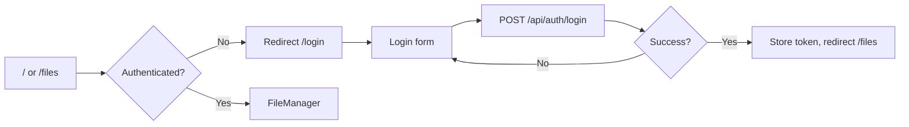

# Client UI

This document describes the React client’s routing, protected routes, file manager (view modes, sort, search, selection, toolbar, drag-and-drop, context menu, dialogs), share link screen, responsive behavior, and i18n. Reference: [client/src/App.js](../../client/src/App.js), [client/src/pages/FileManager.js](../../client/src/pages/FileManager.js), and related components.

---

## Overview

The app is a single-page React application using React Router. Public routes include login and register; authenticated routes (files, mypage; /admin redirects to /mypage) are wrapped in `PrivateRoute`, which redirects to `/login` when the user is not authenticated. The main file management UI supports list/grid/detail views, sort by name/date, search, multi-selection, and toolbar actions (move, copy, download, delete) with progress and cancellation. Dialogs handle rename, create folder, upload, share, folder picker, conflict resolution, and preview. Share link access is handled by `/share/:token`, which loads link info then renders either the file manager (folder) or a single-file preview. A FAB (on all viewports) and action sheet (on mobile) provide touch-friendly actions. UI text is localized (i18n) with English and Korean.

---

## Specification

### Routing

- **Public:** `/login`, `/register`. No auth required.
- **Default:** `/` redirects to `/files`.
- **Authenticated (under MainLayout):** `/files/*` (FileManager), `/mypage` (MyPage). `/admin` redirects to `/mypage` with `state: { category: 'admin' }` for admin users. Wrapped in `PrivateRoute`: if not authenticated, redirect to `/login`; while loading auth state, show loading spinner.
- **Share link:** `/share/:token` — Renders `ShareLinkLoader`, which fetches `GET /api/share/:token/info` then either `FileManager` (folder) or `ShareLinkSingleFileView` (single file). No auth required for viewing; login/add-to-my-permissions available in share UI.

### MyPage (Chrome-style layout)

- **Layout:** Chrome Settings–style layout. PC: fixed left category sidebar 200px wide (same as FileManager folder tree; no divider between sidebar and content), content area on the right. Mobile: category list in SwipeableDrawer; Menu button opens drawer; selecting a category closes drawer.
- **Content area:** Content is centered with max-width (560px) for mobile/PC UI consistency. MyPage content components use mobile-style UI (compact layout, full-screen dialogs where applicable).
- **AppBar:** PC — Logo (left, same as FileManager), Close (X, right). Mobile — Menu (left), Close (right). Logout and language moved into content (Account bottom, Preferences).
- **Categories:** Account (profile, edit, logout), Sharing (inbox/outbox/share links; hidden for admin), Admin (users, settings; admin only), Preferences (language).
- **List → Detail:** Sharing and Admin use list view of sub-items; click opens detail with Back button.

### PrivateRoute

- Uses `useAuth()` for `isAuthenticated` and `loading`.
- If `loading`, render a full-height loading spinner (e.g. `CircularProgress`).
- If not authenticated, render `<Navigate to="/login" replace />`.
- Otherwise render `children`.

### File manager (FileManager.js and components)

- **View modes:** List, grid, detail (from `VIEW_MODES` in `constants/fileManager.js`). Persisted in localStorage (e.g. `getViewMode`, `setViewMode`).
- **Sort:** Name/date, asc/desc (`SORT_MODES`). Persisted (e.g. `setSortMode`, `saveSortMode`). Applied via `sortFiles()` before render.
- **Search:** Floating search bar (FloatingSearchBar) to the left of the FAB. Unified behavior on mobile and desktop: always visible, no toggle. Desktop: fixed 300px width; mobile: full remaining width minus margins and FAB. Styled with gradient outline (same palette as AppBar/FAB), pill shape, matte light interior. Search query filters or highlights items by name. Scroll container uses bottom padding equal to the floating area height so the last list item can scroll above the search bar.
- **Selection:** Multi-select driven by file interactions (no manual selection mode toggle). Desktop: single click enters selection mode and selects that file; double click opens folder/preview; Ctrl+click adds/removes; Shift+click range-selects; click on empty space exits selection mode. Mobile: touch opens folder/preview; long-press enters selection mode and selects that file; in selection mode, tap toggles selection. When `selectedFiles.size === 0`, selection mode auto-exits. `useSelection` holds selected set; clear selection after successful operation or on path change.
- **Toolbar (bulk actions):** When one or more items selected, FileManagerControls shows bulk action buttons (Move, Copy, Download, Delete) inline in the same row, replacing sort and view mode. No manual selection mode toggle button; entry/exit driven by file interactions and selected count. Uses icon buttons. Same layout on desktop and mobile. Actions open folder picker (move/copy) or confirm dialog (delete). Progress shown via `FileOperationProgress`; cancel via bulk operation cancel API.
- **Progress UI (FileOperationProgress):** Shrink state: compact chip in AppBar. Click opens right-side Drawer. Collapsed: all operation headers with "펼치기" button above each body. Expanded: single item fills drawer with "접기" at bottom. Auto-collapse on new preparing; on error/warning, expand that item when drawer is opened (no auto-open).
- **Rename dialog:** Single item rename; `PUT /api/files/rename` with `oldPath`, `newName`. On success, refresh list and recent files if needed.
- **Drag and drop:** Drop on folder tree or list to upload (to current or dropped folder) or to move/copy; `useDropToUpload` and paste/move/copy handlers. Conflict check before paste via `checkConflicts`; conflict resolve dialog when needed.
- **Context menu (desktop):** Right-click on file/folder: Download, Rename, Move, Copy, Delete, Share, etc. Actions open the same dialogs as toolbar.
- **Item-level More button:** Each file item (list, grid, detail) has a More (⋮) button. Visible when *not* in selection mode; hidden when in selection mode. Opens `FileActionSheet` for that file. Placed: list = right side of item; grid = top-right of preview (thumbnail/icon) area, overlaid with z-index; detail = right end of row (last column).
- **Action sheet (mobile):** More button or right-click triggers bottom action sheet (`FileActionSheet`) with same actions as context menu. Long-press no longer opens context menu; it enters selection mode (see Selection above).
- **Dialogs:** Upload, CreateFolder, FilePreview, FolderPicker, Share, ShareTarget, FileProperties, Confirm, ConflictResolve, Rename, Login (for share link when not logged in). Dialog state managed in `useFileManagerDialogs` or similar; list refreshes after successful close.
- **Share link mode:** When `shareToken` and `linkInfo` are passed (e.g. from ShareLinkLoader), file manager shows only the share root; write actions may be disabled; “Add to my permissions” and “Login” available via FAB or header.

### Share link screen (`/share/:token`)

- **ShareLinkLoader:** Reads `token` from route params; calls `getPublicShareLinkInfo(token)`. While loading, shows spinner and “Loading” text. On error (e.g. 404, 410), shows error message. On success:
  - If `linkInfo` indicates directory: render `FileManager` with `shareToken` and `linkInfo` (browse shared folder).
  - If single file: render `ShareLinkSingleFileView` (full-screen preview/download).
- **ShareLinkSingleFileView:** Preview or download for the shared file; optional “Login” or “Add to my permissions” when user is logged in.

### Responsive and mobile

- **Breakpoints:** MUI theme breakpoints (xs/sm/md/lg/xl). `useResponsive` (or similar) exposes `isMobile` for conditional layout.
- **FAB and search:** Search bar (FloatingSearchBar) is positioned to the left of the FAB at bottom-right. FAB: shown on all viewports (mobile and desktop). Speed dial: Upload, Create folder. Share link mode: Login or Add to my permissions. FAB hidden when selection mode. When FAB is hidden, the search bar expands to occupy the FAB’s space.
- **Breadcrumb:** Path breadcrumb (chips) for current folder, shown on all viewports above the selection/sort/view-mode row.
- **Action sheet:** On mobile, More button on each item opens bottom sheet. Long-press enters selection mode only (does not open action sheet); the browser `contextmenu` event fired by long-press is ignored on mobile.
- **Pull-to-refresh:** Optional pull-to-refresh on mobile to reload current folder.

### i18n

- **Library:** react-i18next; resources from `client/src/locales/en.json`, `ko.json`.
- **Initial language:** From `navigator.language` (e.g. `ko` → Korean, else English); fallback `en`.
- **Usage:** `useTranslation()` → `t(key, params)` for all user-facing strings. Server errors displayed via `t(errorCode, params)` (see [shared-contracts.md](../shared-contracts.md)). Language can be switched in UI (e.g. settings or header); preference may be stored in localStorage.

---

## Flows

### App entry and login

- On load, `AuthProvider` checks sessionStorage for token; if present, sets axios header and calls `GET /api/auth/me`. 401만 global logout/redirect 처리; 403은 apiClient에서 별도 정책에 따라 처리 (URL 이동 직후: history.back() 또는 '/', 그 외: 리다이렉트 없음).

### File manager: multi-select and batch

1. User enters selection mode via desktop single click or mobile long-press. Desktop: single click selects one, Ctrl+click adds/removes, Shift+click range-selects. Mobile: in selection mode, tap toggles selection. Toolbar appears when one or more items selected (Move, Copy, Download, Delete).
2. User clicks Move → Folder picker opens → user chooses destination → `POST /api/files/batch-move` (or bulk job). Progress dialog shows; user can cancel via `POST /api/files/bulk-operation/:jobId/cancel`.
3. On success, list and folder tree refresh; `POST /api/recent-files/apply-moves` if applicable. Selection cleared.
4. Delete flow: Confirm dialog → `POST /api/files/batch-delete` → progress → `POST /api/recent-files/remove-paths` → refresh.

### Share link screen

1. User opens `/share/:token`. ShareLinkLoader fetches `GET /api/share/:token/info`.
2. If error (404/410): show error message (e.g. “Link expired”).
3. If directory: render FileManager with share context; user browses; may see “Login” or “Add to my permissions” (FAB or header).
4. If file: render ShareLinkSingleFileView; user can preview/download and optionally add to permissions if logged in.

### Language switch

- User changes language in UI (if provided). App calls `i18n.changeLanguage(lang)`; all `t()` strings update. Optionally persist language in localStorage and set as `i18n.language` on next load.

---

## Testing

When implementing or reviewing client tests, cover at least:

- **Routing and PrivateRoute:** Unauthenticated access to `/files`, `/mypage` redirects to `/login`. Authenticated access renders the correct page. `/admin` redirects to `/mypage` with Admin category selected. Loading state shows spinner.
- **View/sort/search and toolbar:** View mode and sort mode change UI layout and order; search filters or highlights; selecting items shows toolbar; toolbar actions trigger correct API calls (MSW) and list refresh.
- **Drag-drop and dialogs:** Drop triggers upload or move/copy; conflict dialog appears when name conflicts; rename dialog calls rename API and refreshes list. Assert on API calls and list state.
- **Share link:** `/share/:token` loads; with MSW returning directory vs file, correct component (FileManager vs ShareLinkSingleFileView) renders; error response shows error message.
- **Mobile:** FAB shown on all viewports; action sheet on mobile (small viewport). Assertions can be based on visibility or role/label.
- **Errors:** API error responses surface as snackbar or inline message using `t(errorCode, params)` (see [errorUtils](../../client/src/utils/errorUtils.js) and shared-contracts).

Use [TESTING_STRATEGY.md](../TESTING_STRATEGY.md): MSW for API, React Testing Library for components and user flows.
