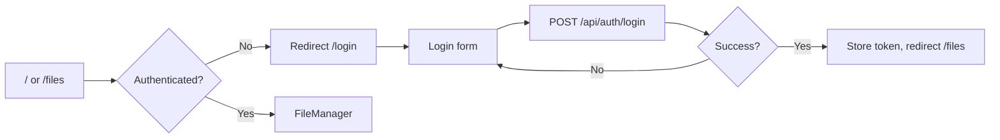

# Client UI

This document describes **product-level** behavior of the React client UI: routing and protected routes, file browsing and operations, share-link access, responsive behavior, and i18n.

It also defines **high-level feature boundaries** for the client refactor:

- **Explorer core**: reusable browsing/selection/navigation/command/progress behavior.
- **Product overlays**: share-link mode, virtual collections (e.g. `__recent__`, `__shared__`), and other product-specific rules.
- **Page shells**: route composition, overlay wiring, and orchestrating controllers into views.

Detailed implementation contracts live in `docs/spec/client/**/*`. Client layering rules are defined in `docs/CODING_STYLE.md` and summarized in `docs/ARCHITECTURE.md` (Client Architecture).

---

## Overview

The app is a single-page React application using React Router.

- **Public access**: login/register and share-link access.
- **Authenticated access**: file browsing and MyPage.
- **File browsing UI**: list/grid/detail views, sort, search, selection, bulk actions, dialogs, and progress/cancellation for long-running operations.
- **Share links**: `/share/:token` can render a folder browsing experience or a single-file preview/download experience, without requiring authentication.
- **Responsive design**: supports mobile- and touch-friendly patterns (FAB, action sheet, drawer navigation on MyPage).
- **Localization**: UI strings are localized (English and Korean).

---

## Specification

### Feature boundaries (client responsibilities)

These boundaries are intentionally written at the **feature level** (not as a file-level spec).

- **Explorer core owns**
  - Browsing and navigation within a folder tree (current path, breadcrumb navigation).
  - List/grid/detail presentation modes and basic state like view mode, sort mode, and search query.
  - Selection rules and bulk action affordances.
  - File commands and progress UI (upload, rename, move/copy, delete, download; progress and cancellation).
  - Explorer-specific IO through explorer gateways/adapters rather than page-shell direct service/storage/repository imports.
  - Presentation-neutral rules that should remain consistent across product contexts.

- **Product overlays own**
  - Share-link mode: what is visible and which actions are enabled/disabled when browsing a shared scope.
  - Share-link-specific login, leave-share, and add-to-my-permissions flows.
  - Virtual collections and product-specific sections (e.g. `__recent__`, `__shared__`).
  - Admin-only UI visibility and product policies that are not reusable across contexts.

- **Page shells own**
  - Route composition and route-state parsing (including redirects and share-link bootstrapping).
  - Choosing which overlay is active (normal browsing vs share-link browsing, etc.).
  - Wiring controller outputs into pure views (prepared state + callbacks), without embedding domain rules into views.
  - Selection-reset seams that react to explorer session-boundary changes without pushing that side effect into pure session derivation hooks.
  - When explorer interactions or share-link overlays become flow-heavy, page-local controller hooks should own those flows while the shell remains a composition layer.
  - Page shells should not keep explorer-specific storage helpers, direct permission-service calls, recent-file repository/notifier wiring, metadata enrichment calls, or refresh-policy orchestration inline; those belong to explorer hooks/gateways.

### Routing

- **Public:** `/login`, `/register`. No auth required.
- **Default:** `/` redirects to `/files`.
- **Authenticated (under MainLayout):** `/files/*` (FileManager), `/mypage` (MyPage). `/admin` redirects to `/mypage` with `state: { category: 'admin' }` for admin users. Wrapped in `PrivateRoute`: if not authenticated, redirect to `/login`; while loading auth state, show loading spinner.
- **Share link:** `/share/:token` — Renders `ShareLinkLoader`, which fetches `GET /api/share/:token/info` then either `FileManager` (folder) or `ShareLinkSingleFileView` (single file). No auth required for viewing; login/add-to-my-permissions available in share UI.

#### Routing contracts (migration-sensitive)

These are stable user-visible contracts that must remain true during router upgrades (including React Router v6 → v7 migration work):

- **Explorer route remains the splat owner:** `/files/*` is the only route that owns the explorer “current folder” path derived from a splat param. The explorer path is represented as an absolute path string starting with `/` (e.g. `/`, `/Documents`, `/a/b`).
- **Splat path is owned by FileManager listing/navigation seams:** the FileManager shell wires route params into `useFileManager` (and/or the navigation seam). It must not duplicate splat parsing in multiple places.
- **Redirect behavior is stable:**
  - `/` redirects to `/files` (authenticated users see FileManager; unauthenticated users end up at `/login` via PrivateRoute).
  - Unauthenticated access to `/files/*` and `/mypage` redirects to `/login`.
  - `/admin` redirects to `/mypage` with `location.state.category` set so MyPage opens the Admin category (see MyPage spec for normalization rules).

#### Router upgrade flags and consistency

When adopting router future flags in v6 (to surface v7 behavior changes early), ensure the same flags are enabled in:

- **Runtime router setup** (the app router).
- **Test router setup** (Jest helpers using `createMemoryRouter` / `RouterProvider`).

At minimum, enable:

- `v7_startTransition`
- `v7_relativeSplatPath`

Once the client is upgraded to React Router v7, these behaviors are treated as the baseline and **tests must continue to exercise routing via the same router APIs** (`createBrowserRouter`/`createMemoryRouter` + `RouterProvider`) so `/files/*` splat parsing and nested layout behavior remain consistent with runtime.

### MyPage (Chrome-style layout)

- **Layout:** Chrome Settings–style layout. PC: fixed left category sidebar (no divider between sidebar and content), content area on the right. Mobile: category list in SwipeableDrawer; Menu button opens drawer; selecting a category closes drawer.
- **Content area:** Content is centered with max-width (560px) for mobile/PC UI consistency. MyPage content components use mobile-style UI (compact layout, full-screen dialogs where applicable).
- **AppBar:** PC — Logo (left, same as FileManager), Close (X, right). Mobile — Menu (left), Close (right). Logout and language moved into content (Account bottom, Preferences).
- **Categories:** Account (profile, edit, logout), Sharing (inbox/outbox/share links; hidden for admin), Admin (users, settings; admin only), Preferences (language).
- **List → Detail:** Sharing and Admin use list view of sub-items; click opens detail with Back button.

### PrivateRoute

- Uses `useAuth()` for `isAuthenticated` and `loading`.
- If `loading`, render a full-height loading spinner (e.g. `CircularProgress`).
- If not authenticated, render `<Navigate to="/login" replace />`.
- Otherwise render `children`.

### File browsing (Explorer core + overlays)

- **View modes:** List, grid, detail (from `VIEW_MODES` in `constants/fileManager.js`). Persisted through the existing client preference-storage policy/helper boundary.
- **Sort:** Name/date, asc/desc (`SORT_MODES`). Persisted through the same preference-storage policy boundary and applied before render.
- **Explorer ownership split:** `useExplorerSession` is the single owner of search/sort/view-mode session state and preference persistence. `useFileManager` is the narrow path/listing seam for the active explorer location. Listing, shared-entry loading, capability checks, recent-files persistence, metadata enrichment, and parent-folder verification belong to explorer gateways plus the narrow controller/listing seams that call them. `FileManager` remains the page shell that selects product overlays such as share-link mode and virtual collections, while control-only chrome state such as an open sort menu stays local to the rendered control seam instead of the page shell.
- **Recent-file recovery boundary:** When a recent target must be verified, reopened for preview, or removed as stale, the recent-file controller uses explorer gateway seams for parent-folder checks and recent-entry cleanup instead of importing repository or file-service modules directly. Rollback and toast behavior stay unchanged from the user perspective.
- **Search:** Floating search bar (FloatingSearchBar) to the left of the FAB. Unified behavior on mobile and desktop: always visible, no toggle. Desktop: fixed 300px width; mobile: full remaining width minus margins and FAB. Styled with gradient outline (same palette as AppBar/FAB), pill shape, matte light interior. Search query filters or highlights items by name. Scroll container uses bottom padding equal to the floating area height so the last list item can scroll above the search bar.
- **Selection:** Multi-select driven by file interactions (no manual selection mode toggle). Desktop: single click enters selection mode and selects that file; double click opens folder/preview; Ctrl+click adds/removes; Shift+click range-selects; click on empty space exits selection mode. Mobile: touch opens folder/preview; long-press enters selection mode and selects that file; in selection mode, tap toggles selection. When `selectedFiles.size === 0`, selection mode auto-exits. The selection controller owns the selected set; route/path changes clear selection through the page-shell/session-boundary seam. File rows/cards do not require checkbox widgets for this flow.
- **Toolbar (bulk actions):** When one or more items selected, FileManagerControls shows bulk action buttons (Move, Copy, Download, Delete) inline in the same row, replacing sort and view mode. No manual selection mode toggle button; entry/exit driven by file interactions and selected count. Uses icon buttons. Same layout on desktop and mobile. Actions open folder picker (move/copy) or confirm dialog (delete). Progress shown via `FileOperationProgress`; cancel via bulk operation cancel API. **Mobile multi-download restriction:** On mobile, when multiple items are selected, the Download button is disabled (grayed out); only single-item download is allowed on mobile. This is a client-side UI restriction only.
- **Progress UI (FileOperationProgress):** Shrink state: compact chip in AppBar. Click opens right-side Drawer. Collapsed: all operation headers with an "Expand" button above each body. Expanded: single item fills drawer with "Collapse" at bottom. Auto-collapse on new preparing; on error/warning, expand that item when drawer is opened (no auto-open).
- **Rename dialog:** Single item rename; `PUT /api/files/rename` with `oldPath`, `newName`. On success, refresh list and recent files if needed.
- **Drag and drop:** Drop on folder tree or list to upload (to current or dropped folder) or to move/copy; `useDropToUpload` and paste/move/copy handlers. Conflict check before paste via `checkConflicts`; conflict resolve dialog when needed.
- **Content-area drop overlay scope:** The dotted “drop here” overlay is shown only over the file view content region (list/grid/detail area). It must not cover breadcrumb or toolbar/controls.
- **Cross-DnD (file manager ↔ folder tree):** Dropping a file or folder from the file manager (list/grid/detail) onto a folder in the tree moves it into that folder (same move API). Dragging a folder from the tree and dropping on a folder row in the list/grid/detail, or on the content area, moves that folder into the target folder or current path. Permission rules: same as "When DnD is disabled or denied" for the drop target (tree or list); no-write target shows forbidden cursor and error on drop.
- **When DnD is disabled or denied:** If the dragged item has no write permission (e.g. shared read-only), drag is blocked (item not draggable). If the drop target folder has no write permission: cursor shows forbidden (`dropEffect = 'none'`), the folder is not highlighted as a drop target, and if the user drops anyway an error popup is shown (message key `fileManager.dropNoWritePermission`) and the move is not performed.
- **Same source and destination (no-op):** When the drop would be a no-op (e.g. target folder is the parent of the dragged path, or same path), the folder is not highlighted as a drop target and the content area does not show the drop overlay or message. This avoids showing "drop here" when the move would do nothing.
- **Content area drop copy:** Upload (OS files) and internal move use different copy: upload uses `dialogs.uploadDropHere` (e.g. "Drop files here"); internal move uses `fileManager.moveDropHere` (e.g. "Move here").
- **Context menu (desktop):** Right-click on file/folder: Download, Rename, Move, Copy, Delete, Share, etc. Actions open the same dialogs as toolbar.
- **Item-level More button:** Each file item (list, grid, detail) has a More (⋮) button. Visible when *not* in selection mode; hidden when in selection mode. Opens `FileActionSheet` for that file. Placed: list = right side of item; grid = top-right of preview (thumbnail/icon) area, overlaid with z-index; detail = right end of row (last column).
- **Filename truncation:** All file items (list, grid, detail, and recent files) use middle ellipsis (`pixelMiddleTruncate`) for long filenames, ensuring the file extension remains visible. A `Tooltip` displays the full filename on hover if it is truncated.
- **Action sheet (mobile):** More button or right-click triggers bottom action sheet (`FileActionSheet`) with same actions as context menu. Long-press no longer opens context menu; it enters selection mode (see Selection above).
- **Dialogs:** Upload, CreateFolder, FilePreview, FolderPicker, Share, ShareTarget, FileProperties, Confirm, ConflictResolve, Rename, Login (for share link when not logged in). Dialog state managed in `useFileManagerDialogs` or similar; list refreshes after successful close.
- **Browser-boundary rule for touched views:** Presentational/file-tree/share views must not call `window`, `document`, or `ResizeObserver` directly. Link opening, element observation, and similar browser work must flow through a prepared callback, hook, or adapter boundary.
- **File preview zoom:** PDF and image previews support zoom. Bottom bar (zoom in/out, percentage, reset); Ctrl+wheel on desktop; two-finger pinch on mobile.
- **Share link mode:** When `shareToken` and `linkInfo` are passed (e.g. from ShareLinkLoader), file manager shows only the share root; write actions may be disabled; “Add to my permissions” and “Login” available via FAB or header.

- **Single-file download (iOS + single file):** On iOS (e.g. iPhone Chrome), downloading a single file (any type) uses a share-sheet–friendly path so the user can save to Files or Photos. **Policy:** (1) The app creates a `File` from the blob and calls `navigator.canShare({ files: [file] })` with the actual file; if true, it uses the Web Share API so the system share sheet appears; the user chooses "Save to Files" or similar. (2) If `canShare` returns false or share fails (non-AbortError), the app falls back to blob + `<a download>` + `visibilitychange` revoke. (3) All other cases (desktop, folder download, multi-file zip) keep the existing blob + `<a download>` behavior. **User guidance:** When the share sheet is shown, the UI may show a short hint (e.g. tooltip or toast) that the user can save the file. See `docs/spec/client/services/fileService.md` (§ 2.3) for the service-level spec.

### Share link screen (`/share/:token`)

- **ShareLinkLoader:** Reads `token` from route params; calls `getPublicShareLinkInfo(token)`. While loading, shows spinner and “Loading” text. On error (e.g. 404, 410), shows error message. On success:
  - If `linkInfo` indicates directory: render `FileManager` with `shareToken` and `linkInfo` (browse shared folder).
  - If single file: render `ShareLinkSingleFileView` (full-screen preview/download).
- **ShareLinkSingleFileView:** Preview or download for the shared file; optional “Login” or “Add to my permissions” when user is logged in.

### Responsive and mobile

- **Breakpoints:** MUI theme breakpoints (xs/sm/md/lg/xl). `useResponsive` (or similar) exposes `isMobile` for conditional layout.
- **FAB and search:** Search bar (FloatingSearchBar) is positioned to the left of the FAB at bottom-right. FAB: shown on all viewports (mobile and desktop). Speed dial: Upload, Create folder. Share link mode: Login or Add to my permissions. FAB hidden when selection mode. When FAB is hidden, the search bar expands to occupy the FAB’s space.
- **Breadcrumb:** Path breadcrumb (chips) for current folder, shown on all viewports above the selection/sort/view-mode row.
- **Action sheet:** On mobile, More button on each item opens bottom sheet. Long-press enters selection mode only (does not open action sheet); the browser `contextmenu` event fired by long-press is ignored on mobile.
- **Pull-to-refresh:** Optional pull-to-refresh on mobile to reload current folder.
- **Overscroll:** To prevent mobile bounce from shifting the header and controls, the app uses `overscroll-behavior: none` on html/body (e.g. in index.css) and `overscrollBehaviorY: 'contain'` on the main scroll container so overscroll is contained within the scroll area.

### i18n

- **Library:** react-i18next; resources from `client/src/locales/en.json`, `ko.json`.
- **Initial language:** Derived through the existing language/browser-preference policy (for example browser locale detection), with fallback `en`.
- **Usage:** `useTranslation()` → `t(key, params)` for all user-facing strings. Server errors displayed via `t(errorCode, params)` (see [shared-contracts.md](../shared-contracts.md)). Language can be switched in UI (e.g. settings or header); persisted preferences must remain behind a dedicated storage/policy boundary rather than direct view-layer storage access.

---

## Flows

### App entry and login

- On load, the client initializes auth state from the existing session-storage adapter/policy and validates the session via `GET /api/auth/me`. Authentication errors follow the existing user-visible policy: unauthorized sessions redirect to login; forbidden responses follow the established navigation policy for the current page context.

### File manager: multi-select and batch

1. User enters selection mode via desktop single click or mobile long-press. Desktop: single click selects one, Ctrl+click adds/removes, Shift+click range-selects. Mobile: in selection mode, tap toggles selection. Toolbar appears when one or more items selected (Move, Copy, Download, Delete).
2. User clicks Move → Folder picker opens → user chooses destination → `POST /api/files/batch-move` (or bulk job). Progress dialog shows; user can cancel via `POST /api/files/bulk-operation/:jobId/cancel`.
3. On success, list and folder tree refresh; `POST /api/recent-files/apply-moves` if applicable. Selection cleared.
4. Delete flow: Confirm dialog → `POST /api/files/batch-delete` → progress → `POST /api/recent-files/remove-paths` → refresh.

### Share link screen

1. User opens `/share/:token`. ShareLinkLoader fetches `GET /api/share/:token/info`.
2. If error (404/410): show error message (e.g. “Link expired”).
3. If directory: render FileManager with share context; user browses; may see “Login” or “Add to my permissions” (FAB or header).
4. If file: render ShareLinkSingleFileView; user can preview/download and optionally add to permissions if logged in.

### Language switch

- User changes language in UI (if provided). App calls `i18n.changeLanguage(lang)`; all `t()` strings update. Persisted language preferences, when enabled, flow through the existing preference-storage boundary rather than direct component storage calls.

---

## Testing

When implementing or reviewing client tests, cover at least:

For the full browser-flow inventory and planned Playwright spec ownership across routing, responsive behavior, explorer flows, and share-link flows, see [../E2E_COVERAGE_PLAN.md](../E2E_COVERAGE_PLAN.md). Keep this feature doc focused on user-visible UI behavior and representative testing anchors.

- **Routing and PrivateRoute:** Unauthenticated access to `/files`, `/mypage` redirects to `/login`. Authenticated access renders the correct page. `/admin` redirects to `/mypage` with Admin category selected. Loading state shows spinner.
- **View/sort/search and toolbar:** View mode and sort mode change UI layout and order; search filters or highlights; selecting items shows toolbar; toolbar actions trigger correct API calls (MSW) and list refresh.
- **Selection tests:** Prefer interaction-based assertions (`click`, `Ctrl`/`Meta`+click, `Shift`+click, long-press) and outcome checks. Do not assume file rows expose `role="checkbox"`.
- **Drag-drop and dialogs:** Drop triggers upload or move/copy; conflict dialog appears when name conflicts; rename dialog calls rename API and refreshes list. Assert on API calls and list state.
- **Share link:** `/share/:token` loads; with MSW returning directory vs file, correct component (FileManager vs ShareLinkSingleFileView) renders; error response shows error message.
- **Mobile:** FAB shown on all viewports; action sheet on mobile (small viewport). Assertions can be based on visibility or role/label.
- **Errors:** API error responses surface as snackbar or inline message using `t(errorCode, params)` (see [errorUtils](../../client/src/utils/errorUtils.js) and shared-contracts).

Use [TESTING_STRATEGY.md](../TESTING_STRATEGY.md): MSW for API, React Testing Library for components and user flows.

### Router-test guidance (React Router v6 future flags)

- Prefer `createMemoryRouter` + `RouterProvider` for route-level tests that exercise splats, redirects, nested layouts, and `Outlet`.
- If the runtime router enables future flags (see above), test helpers must enable the same flags to avoid “works in app, fails in tests” splat/relative-navigation drift.

### Mock policy for client tests

- Integration-style component/page tests should prefer MSW handlers (`client/src/mocks/handlers.js`) for API behavior.
- Unit-oriented hook/util/service tests may use module mocks when this keeps tests deterministic and focused on public outcomes.
- For mixed tests, keep UI environment mocks (router/i18n/responsive) at module level and use MSW only for network behavior that is stable in the current test runtime.
- When a page scenario is not about shell-only chrome such as the sidebar tree or background recent-file subscriptions, those seams may be replaced with lighter doubles so the test stays focused on the explorer outcome and avoids unrelated async `act(...)` noise.
- When migrating from module mocks to MSW, consult `.cursor/fail_log.md` first and avoid known unstable patterns (for example, request body parsing that depends on `request.formData()` in jsdom-based runs).
- Test runtime polyfills in `client/src/jest-polyfills.js` must not create persistent `MessageChannel` instances during module initialization. Prefer minimal runtime wiring (e.g. `MessagePort` only when sufficient) to avoid open-handle leaks (`MESSAGEPORT`) at Jest shutdown.
- For render-time async hooks, prefer waiting for a stable user-visible anchor after render or interaction rather than relying on one microtask turn. If a hook test needs tighter control, resolve gateway mocks from a deferred promise inside `act`.
