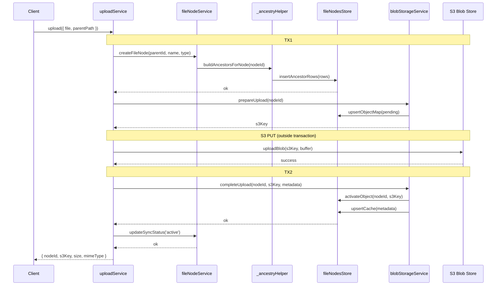
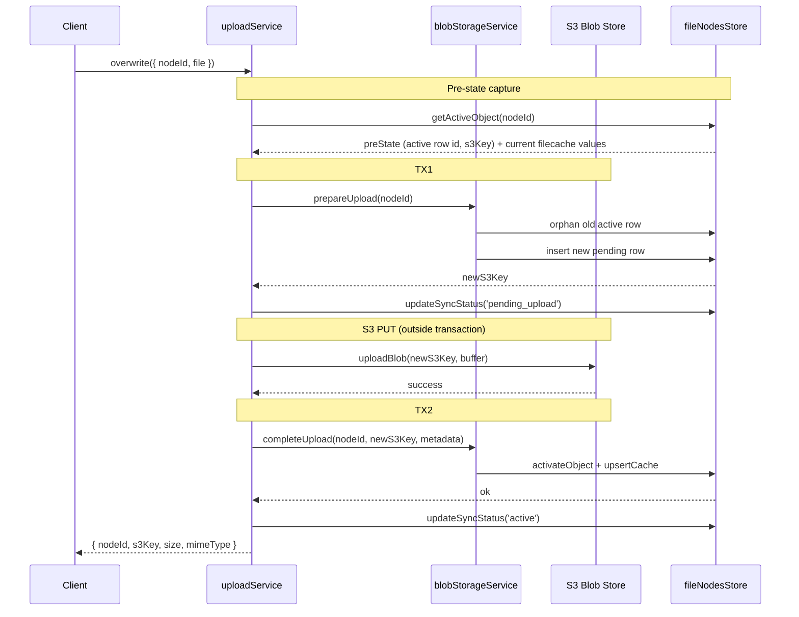
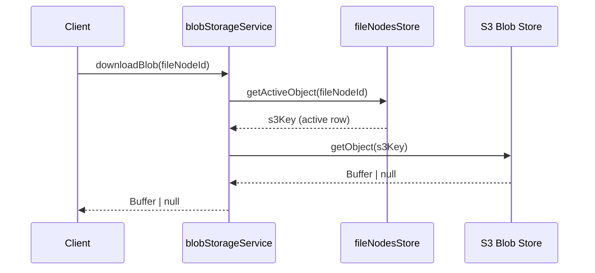
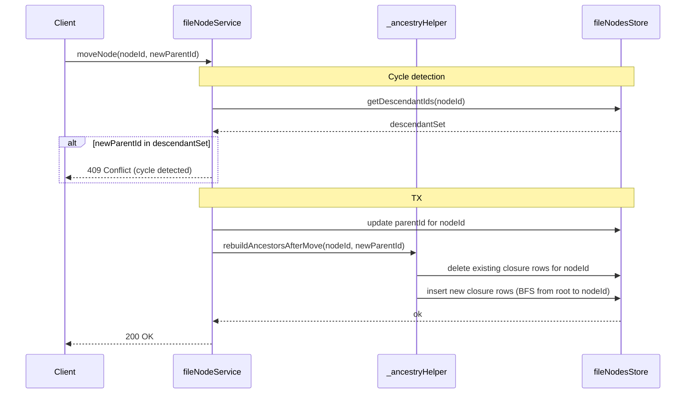

# Core Service Layer

This document describes the Phase 2 core service layer architecture for filesystem tree management, blob lifecycle control, and upload orchestration against the S3+PostgreSQL storage backend. It references [ARCHITECTURE.md](../ARCHITECTURE.md) and [TESTING_STRATEGY.md](../TESTING_STRATEGY.md).

---

## Overview

The core service layer provides filesystem tree management, blob lifecycle control, and upload orchestration for the S3/WebDAV blob backend and the DB metadata store (SQLite by default; PostgreSQL when the remote `WEA_DB_*` block is set). The architecture follows a layered dependency model with factory-function-based dependency injection consistent with existing `createFileService` and `createBlobStore` conventions. Transaction ownership lives at the orchestration layer only — individual service methods are transaction-agnostic.

```
uploadService.js          ← Orchestration (TX1 → S3 PUT → TX2 flow)
  ├── fileNodeService.js   ← Tree operations (create/move/rename/delete/list/resolvePath)
  │       └── _ancestryHelper.js ← Closure table maintenance
  │               └── fileNodesStore.js ← facade → FileNodeRepository → per-dialect impl (sqlite | postgres) via storage.getExecutor() → DbExecutor (infrastructure/db)
  └── blobStorageService.js ← Blob lifecycle (prepareUpload → completeUpload → download)
          └── S3BlobStore / NoOpBlobStore (Phase 1 adapters)
```

---

## Responsibility boundaries

| Service              | Owns                                                                                | Does NOT own                                                                          |
| -------------------- | ----------------------------------------------------------------------------------- | ------------------------------------------------------------------------------------- |
| `uploadService`      | TX boundaries, 4-step flow coordination, S3 PUT between transactions                | No direct DB queries; no raw blob operations                                          |
| `fileNodeService`    | Tree CRUD, cycle detection, path resolution, ancestor chain dispatching             | No closure table algorithms (delegates to `_ancestryHelper`)                          |
| `_ancestryHelper`    | Closure table algorithms: build on insert, rebuild on move (BFS), cleanup on delete | No DB queries; calls only `fileNodesStore` methods                                    |
| `blobStorageService` | Object map lifecycle (`pending→active→orphaned`), filecache metadata writes         | No direct S3 operations except `downloadBlob` pass-through and `overwriteBlob` upload |
| `fileNodesStore`     | Facade over `FileNodeRepository`; SQL/dialect code lives in the repository impls, executed through the `DbExecutor` | No transaction wrapping; no business logic beyond delegation to `FileNodeRepository` |

These boundaries are about **who owns data mutations and orchestration concerns**; they define the service contract surface that tests verify against.

---

## Flows

### Upload flow (4-step)



### Overwrite flow



If the S3 PUT or TX2 fails, a best-effort rollback (one TX) reactivates the pre-state active row
(`reactivateObjectMapRow(preState.id)`), restores `sync_status='active'`, deletes the pending
v_{k+1} row, deletes the new blob (`deleteBlob(newS3Key)`) and re-asserts the captured filecache
values. The last-good blob B_k is never deleted; the original error is re-thrown.

### Download flow



### Move flow (with closure table rebuild)



---

## Failure recovery

| Failure Point | DB State                                                                                          | S3 State          | Recovery Path                                                                                          |
| ------------- | ------------------------------------------------------------------------------------------------- | ----------------- | ------------------------------------------------------------------------------------------------------ |
| TX1 fails     | ROLLBACK, nothing persisted                                                                       | Nothing           | Idempotent retry                                                                                       |
| S3 PUT fails  | New-file upload: node rolled back (deleteNode), nothing persisted                                 | Nothing or partial object | None needed — no visible residue; untracked partial object is a Tier 2 GC target                |
| TX2 fails     | New-file upload: node rolled back (deleteNode), nothing persisted                                 | Blob exists in S3 | Blob is untracked; GC Tier 2: `listOrphanedKeys` finds S3 blob with no DB mapping → deletes it          |
| S3 PUT / TX2 fails (overwrite of an existing file) | Rolled back to pre-state: node `active`, previous active row reactivated, pending v_{k+1} row deleted | Pending blob deleted best-effort; last-good blob B_k kept | File remains downloadable as the previous version; only a rollback's own failure leaves `sync_status='pending_upload'` — in that stuck state GC guards the last-good orphaned row (never deleted while the node has no active row) and cleans the pending row + blob after `GC_PENDING_STALE_DAYS`; admin repair actions `complete` / `restore-previous` / `delete` / `auto` resolve it on demand and a report-only startup scan lists it (DEF-12/13, `docs/IMPROVEMENT_PLAN.md`; repair contract: `docs/spec/server/services/uploadService.md` §2.5.1; GC contract: `docs/spec/server/services/gcService.md`) |

> Note: `uploadService.uploadFile` (new file) rolls back the created node on any failure after TX1 so
> a failed upload never leaves a phantom 0-byte file in listings. `overwriteFile` (existing file)
> rolls back to the captured pre-state on S3 PUT or TX2 failure — the previous active `object_map`
> row is reactivated, the node returns to `active`, and the last-good blob is kept, so the file stays
> downloadable as the previous version. Only if the rollback itself fails does the `pending_upload`
> stuck state remain — repairable via the fail-safe scan/repair actions and cleaned by GC
> (DEF-12/13, `docs/IMPROVEMENT_PLAN.md`).

---

## Testing strategy

### Unit vs integration split

- **fileNodesStore tests:** In-memory SQLite backend, verify all CRUD + ancestor + object_map operations. No mocks — real database queries.
- **Repository conformance:** per-dialect SQL behavior is covered by `server/store/repositories/__tests__/FileNodeRepository.conformance.test.js` — runs on real SQLite by default and on real PostgreSQL under the adapter leg (`test:ci:pg:adapters`).
- **\_ancestryHelper tests:** Real `fileNodesStore` against in-memory SQLite. Verify closure table correctness at depth 0/1/N after every mutation.
- **blobStorageService tests:** `s3Mock` for S3 operations, real SQLite for DB layer. Verify `pending→active→orphaned` transitions.
- **uploadService tests:** Integration test with real SQLite + `s3Mock`. Simulate failure at each of 3 points (TX1, S3 PUT, TX2), verify recoverable state after each.

### Mock strategy

- `s3Mock` — in-memory Map-backed mock of S3 operations; no real AWS connection required.
- SQLite — real in-memory database for all tests (not a mock).
- No mocking of `fileNodesStore` or storage layer in service-level tests.

Use [TESTING_STRATEGY.md](../TESTING_STRATEGY.md) for contract and mocking guidance.

---

## Scope notes

- **Phase 2 delivered S3 mode only.** WebDAV blob storage support was deferred from Phase 2 to Phase 4 (not Phase 3), where `blobStorageService` was extended with a `WebdavBlobStore` adapter (Phase 4 Task 4.0). Blob mode is selected via `WEA_FILE_STORAGE=s3|webdav`.
- **Phase 4 added a composition root** (`server/service/composition.js`): it builds `fileNodeService`, `blobStorageService`, `uploadService`, `aclService`, and `fileService` once at startup. The blob store (S3BlobStore vs WebdavBlobStore) and file storage mode (`fileStorageMode` from `WEA_FILE_STORAGE`, default `'s3'`) are resolved there and injected into the services, so no service reads backend-specific config directly.
- **Version history** infrastructure is in place (`version_number` column in `object_map`); `version_number` increments per node on every `upsertObjectMap` (prior versions become orphaned rows), while only the `active` row is used for reads. Multi-version browse/restore is a future expansion.
