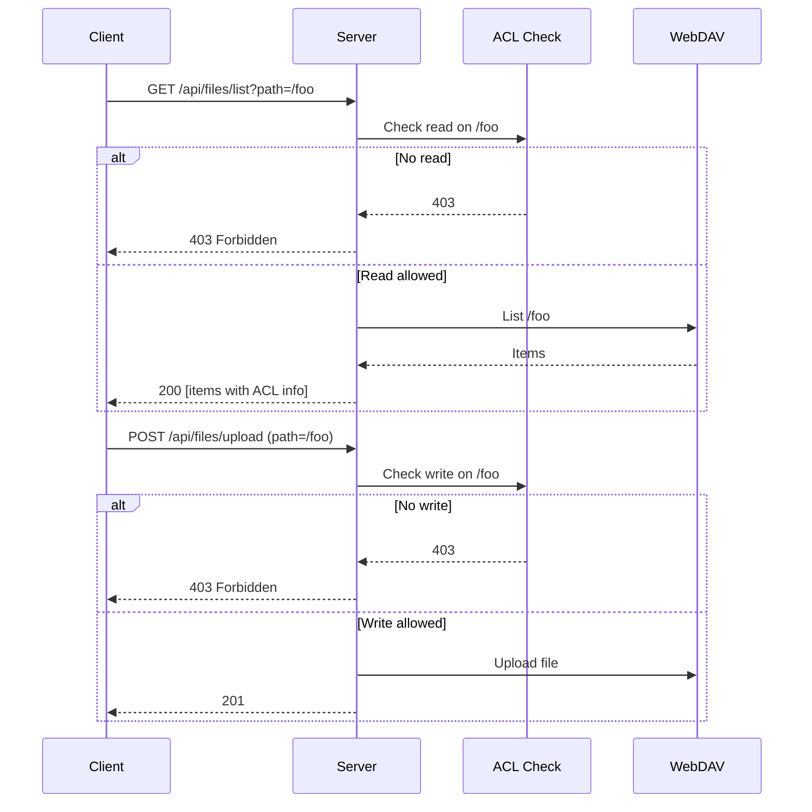
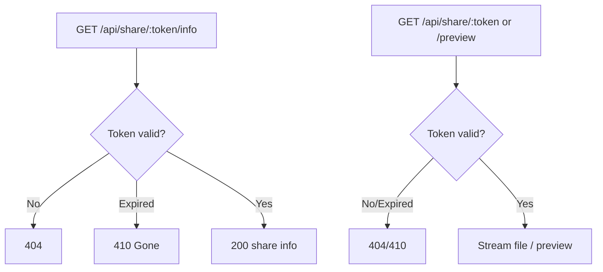

# Files, Folders, Sharing, and Recent Files

This document describes the product behavior around browsing and operating on files/folders, sharing, permission requests, and recent files. It references [api.md](../api.md), [ARCHITECTURE.md](../ARCHITECTURE.md), and [permissions.md](permissions.md).

---

## Overview

Users manage files and folders through a path-based API. The server enforces ACL (direct read/direct write) on every request; list/read require permission on the folder (or the file’s parent), and write operations require write (or admin) on the target folder. Batch operations (move/copy/delete) use selective transfer/delete logic: the server traverses trees, checks ACL at each node, and only acts on allowed items; after completion it updates or revokes permission metadata. Thumbnails are generated server-side and cached. Sharing features provide time-limited public access to a file or folder (share links) and controlled access via permissions. Recent files are stored per user and updated after bulk operations.

---

## Responsibility boundaries (client)

This project is refactoring the client so responsibilities are explicit and replaceable. For files and sharing, the important boundary is **explorer core vs product overlays**:

- **Explorer core (file browsing & operations)**
  - Presents folder contents, sorting/searching, selection, and progress UI.
  - Orchestrates file operations (upload/rename/move/copy/delete/download) against authenticated APIs.
  - Does **not** own sharing policy, permission-request workflows, or recent-files persistence. It can *signal* that an operation occurred (e.g., “paths moved”) so overlays can react.

- **Sharing overlay (share dialog, permission management, share links)**
  - Handles user-facing sharing flows: granting/revoking access, reviewing existing permissions, and creating/updating share links.
  - Owns product rules such as “who can share what”, and admin/review mode branching.
  - Uses explorer UI state (current path / selection) as inputs, but remains a distinct feature module.
  - Controller hooks may orchestrate dialog state, but permission persistence and request-side IO should flow through sharing gateways/use-cases rather than raw service loops inside views.
  - Share-link-specific add-to-my-permissions and leave-share confirmation flows should live in a dedicated product-overlay controller, not inline inside the FileManager page shell.
  - Public share-link browsing and internal user-to-user sharing are distinct product surfaces: share-link mode starts from `/share/:token`, while internal sharing starts from authenticated explorer/MyPage flows and surfaces granted content under `__shared__`.

- **Permission requests (request/approve/reject/cancel)**
  - Handles the request lifecycle between requester and owner.
  - Is separate from direct permission grant/revoke actions: request flows are user-to-user and stateful, while grant/revoke are immediate permission mutations.

- **Recent files (persistence & synchronization)**
  - Records a per-user list of recently accessed items and keeps it consistent after rename/move/delete.
  - Is not a UI-only concern: it has server-backed persistence and dedicated update endpoints.
  - Explorer and sharing features should treat “recent files” as a separate capability they notify, not embed.
  - Client callers should route server-backed recent-file mutations through `recentFilesRepository`, subscribe through `recentFilesNotifier`, and keep path-mutation planning inside the pure `recentFiles` helpers.
  - UI refresh for `/__recent__` should be driven by notifier-triggered reloads after successful observable recent-file mutations, not by ad-hoc cross-feature state pokes.
  - `__recent__` is a browser-visible virtual collection layered on top of explorer behavior; its deeper synchronization rules still belong to repository/notifier and lower-layer tests.

These boundaries are about **who owns product rules and side effects**; they are not a server contract change.

---

## Server-facing capabilities (reference)

This section is a reference summary of the existing endpoints that back the above behaviors. Detailed contracts live in [api.md](../api.md) and related server specs.

### Files and Folders

- **List:** `GET /api/files/list?path=...` — Returns folder contents with ACL info. Path normalized; `/.wea` blocked for non-admin.
- **Download:** `GET /api/files/download?path=...` — Single file download (token or share token where supported).
- **Upload:** `POST /api/files/upload` — Multipart `file`, body/query `path`. Checks parent write permission.
- **Rename:** `PUT /api/files/rename` — Body: e.g. `oldPath`, `newName`.
- **Batch move:** `POST /api/files/batch-move` — Body: e.g. `sourcePaths`, `destinationPath` or `moves[]`. ACL updated for moved items.
- **Batch copy:** `POST /api/files/batch-copy` — Body: e.g. `sourcePaths`, `destinationPath` or `copies[]`. Conflict handling (e.g. `onConflict`) as per api.
- **Batch delete:** `POST /api/files/batch-delete` — Body: e.g. `paths`. Only items the user is allowed to delete; permission metadata cleaned up.
- **Create folder:** `POST /api/folders/create` — Body: `path`.
- **Check conflicts:** `POST /api/files/check-conflicts` — Body: e.g. `paths`, `destinationPath`. Used before paste.
- **Metadata:** `POST /api/files/metadata` — Body: e.g. `paths`.
- **Download multiple (ZIP):** `POST /api/files/download-multiple`, `GET /api/files/download-progress/:id`.
- **Bulk operation progress:** `GET /api/files/operation-progress/:id`, `GET /api/files/bulk-operation/:jobId`, `POST /api/files/bulk-operation/:jobId/cancel`.

All path parameters are normalized by middleware; `path`, `sourcePath`, `destinationPath`, `oldPath`, `folderPath` are normalized. Access to `/.wea` is blocked for non-admin (see [ARCHITECTURE.md](../ARCHITECTURE.md) and [permissions.md](permissions.md)).

### Thumbnails and Preview

- **Single:** `GET /api/files/thumbnail/:hash` or `GET /api/thumbnails/:hash.:ext` (optional token for shared content).
- **Batch:** `POST /api/files/thumbnails/batch` — Body: e.g. `paths` or items with path/hash. Used for viewport-based loading.
- Thumbnails: server-side resize (Sharp); video frame extraction via FFmpeg. Cached in memory (LRU, max 1000). See ARCHITECTURE §3.1.

### Permissions (grant/revoke)

- Grant: `POST /api/permissions/grant` — Body: `folderPath`, `userId`, `permission`; optional `target: 'file'` for file-level.
- Revoke: `DELETE /api/permissions/revoke` — Query: `userId`, `folderPath`; optional `includeSubfolders`, `scope`.
- Folder/file list and check: `GET /api/permissions/folder?path=...`, `GET /api/permissions/check?path=...`, and file-level endpoints as in [api.md](../api.md).

### Permission Requests

- Create: `POST /api/permission-requests` — Body: `folderPath` or `filePath`, `permission`, optional `message`.
- Inbox/outbox: `GET /api/permission-requests/inbox`, `GET /api/permission-requests/outbox`.
- Check owner: `GET /api/permission-requests/check-owner?folderPath=...` or `?filePath=...`.
- Actions: `POST /api/permission-requests/:id/approve`, `POST /api/permission-requests/:id/reject`, `POST /api/permission-requests/:id/cancel`.

### Share links (authenticated)

- Create: `POST /api/share-links` — Body: e.g. `filePath`, `expiresInDays`.
- List/Get/Update/Delete: `GET /api/share-links`, `GET /api/share-links/:token`, `PUT /api/share-links/:token`, `DELETE /api/share-links/:token`.

### Share (public)

- Info: `GET /api/share/:token/info` — No auth; returns share link info (e.g. name, type, expiry). 410 when expired.
- Download: `GET /api/share/:token` — Public download.
- Preview: `GET /api/share/:token/preview` — Public preview.
- For logged-in users: `GET /api/share/:token/check-my-permission`, `POST /api/share/:token/add-to-my-permissions`.

### Recent Files

- List: `GET /api/recent-files`.
- Add: `POST /api/recent-files` — Body: `path`; optional `name`, `type`, `basename`.
- Remove one: `DELETE /api/recent-files/:filePath(*)` (path may contain slashes).
- Clear all: `DELETE /api/recent-files`.
- After bulk move: `POST /api/recent-files/apply-moves` — Body: array of moves (old path → new path).
- After delete: `POST /api/recent-files/remove-paths` — Body: `filePaths`, `folderPaths` arrays.

---

## Flows

### Folder list and upload

### Batch move and ACL / recent files

1. Client sends `POST /api/files/batch-move` with `moves` (or sourcePaths + destinationPath).
2. Server runs selective transfer: traverse source trees, check current user ACL at each path, move only allowed items; update `/.wea/permissions/...` for moved paths.
3. Recent-files synchronization runs separately from the move itself: call `POST /api/recent-files/apply-moves` with the same move mapping so the recent list stays consistent.
4. On batch delete, call `POST /api/recent-files/remove-paths` with `filePaths` and `folderPaths` to remove deleted items from the recent list.

### Share link (public)

### Permission request lifecycle

- Requester: `POST /api/permission-requests` → request created (pending).
- Owner: `GET /api/permission-requests/inbox` → see request; `POST .../approve` or `.../reject`.
- Requester: `GET /api/permission-requests/outbox` → see status; `POST .../cancel` to cancel pending.
- State transitions: pending → approved | rejected | cancelled (see [shared-contracts.md](../shared-contracts.md) for `PERMISSION_REQUEST_STATUS`).

### User-facing collection overlays

- `__shared__` is the authenticated browser entry for internal sharing outcomes. It is where a non-admin user discovers content that became accessible through direct permissions or approved requests.
- After an approved internal permission request, the granted target becomes discoverable to the requester under `__shared__` (with observable read-only vs write-capable affordances based on the granted permission).
- `__recent__` is the authenticated browser entry for previously accessed content. It may reopen previews or remove/recover stale entries, but it does not redefine explorer core navigation rules.
- These overlays are product-visible behaviors and therefore belong in browser-flow planning when the user can navigate into them and observe list/preview/denial outcomes.

---

## Testing

When implementing or reviewing tests for files and sharing, cover at least:

For the full browser-flow inventory, rollout order, and Playwright ownership map, see [../E2E_COVERAGE_PLAN.md](../E2E_COVERAGE_PLAN.md). Keep this feature doc focused on product behavior and representative verification anchors rather than the exhaustive E2E checklist.

### E2E selector policy

- Prefer semantic selectors first:
  - login and dialog text inputs via role/label or stable form attributes
  - dialogs via `getByRole('dialog')` and visible heading/submit affordances when the text is stable
- Target concrete explorer items by the existing `data-file-path` container attribute in list and grid views instead of adding per-item test IDs.
- Add `data-testid` only for documented unstable seams whose structure is icon-driven, cross-viewport, or otherwise difficult to target semantically:
  - file-action FAB root
  - file action entries that appear in desktop context menu and mobile action sheet (for example rename/delete)
  - dialog fields or submit buttons whose stable access would otherwise depend on localized text
- Once the FAB is open, prefer the visible `menuitem` names for create/upload when those names are stable in the E2E environment.

### E2E flow structure

- Keep flow coverage split by platform responsibility instead of branching inside a shared test body.
- Shared helpers may hold only platform-agnostic seams such as auth, deterministic naming, fixture loading, and common file-item locators.
- Shared explorer helpers may also own the common entry seams for opening the FAB menu and an item's shared "More actions" button, but the follow-up desktop context-menu and mobile action-sheet behavior must remain spec-owned.
- Desktop and mobile flow specs both verify the same CRUD outcomes:
  - login
  - create folder through the FAB flow
  - upload file through the FAB/dialog flow
  - rename
  - delete
- The platform-specific difference is the file-action surface for rename and delete:
  - desktop uses desktop item actions/context-menu style entry points
  - mobile uses the action sheet
- When desktop and mobile verify the same outcome, document the shared outcome once and only call out the interaction surface where the platforms genuinely differ.

### Public share-link E2E anchors

- Entry and error state: when visiting `/share/:token` with an invalid/expired token, assert a visible share error UI (do not depend on precise expiry timing beyond the "expired/not found" user-facing outcome).
- Read-only mode (directory shares): in shared directory mode, assert that write-capable outcomes are not available via the browser UI (e.g. upload/create/rename/delete/share actions are absent or disabled), while directory listing remains visible.
- Anonymous access from shared directories: for an anonymous user inside a shared directory, assert that the login entry point is reachable from the shared surface (e.g. a login dialog/route is shown).
- Add-to-my-permissions (authenticated users): for logged-in users in shared directory mode, assert the visible add-to-my-permissions confirmation flow succeeds and that the browser transitions back to the normal explorer `/files` route.
- Leaving share scope: for authenticated users inside shared directory mode, assert that the visible "leave share" confirmation appears and that confirming returns the user to regular explorer navigation.
- Preview within shared scope: even in public shared directory mode, assert that previewable files can still open the preview dialog from the shared explorer.
- Deterministic E2E setup guidance: for prerequisites, prefer API-backed fixture creation (e.g. create folder + upload) followed by `POST /api/share-links`, then navigate to `/share/:token` for the observable assertions.
- Session prep guidance: for anonymous share scenarios, use a dedicated helper that clears cookies/storage (or uses a fresh browser context) before visiting `/share/:token`; for logged-in share scenarios, always navigate with an authenticated session established first.

### Browser coverage boundary for sharing-related flows

- Keep the canonical inventory, priorities, and spec ownership in [../E2E_COVERAGE_PLAN.md](../E2E_COVERAGE_PLAN.md).
- Playwright should cover representative user-visible journeys:
  - public share-link error/success states
  - add-to-my-permissions and leave-share outcomes for directory shares
  - internal permission-request lifecycle anchors such as request, approve/reject, and resulting `__shared__` access
  - `__recent__` and `__shared__` entry/navigation flows that a user can observe in the browser
  - visible read-only versus write-capable outcomes for granted shared content
- Lower layers should continue to own broader matrices and infra-sensitive branches:
  - ACL inheritance and non-inheritance combinations
  - full permission allow/deny combinations beyond one representative visible denial
  - recent-files synchronization internals after move/delete
  - drag-and-drop cursor/gesture subtleties unless a stable browser-visible smoke is explicitly promoted

### Representative verification anchors

- **Explorer CRUD happy paths:** Desktop and mobile both keep create folder, upload, rename, and delete in browser-visible coverage. The detailed scenario inventory and spec ownership live in [../E2E_COVERAGE_PLAN.md](../E2E_COVERAGE_PLAN.md).
- **Explorer navigation anchors:** Browser coverage should keep direct `/files/<path>` entry and breadcrumb chip navigation focused on visible folder changes, using route results and `data-file-path` item visibility rather than internal router state.
- **Preview flows:** For previewable files, browser coverage should assert the platform-owned preview entry seam and the visible full-screen preview dialog, without coupling to preview-loader internals.
- **Batch operations and conflicts:** Move/copy/delete, conflict resolution, bulk progress, and recent-files synchronization remain important coverage targets, but the exhaustive browser-vs-integration split is tracked in the canonical E2E plan. For browser coverage of bulk move/copy, treat folder selection as the start of a job-backed flow and wait for a visible completion signal before asserting destination contents.
- **Share and permission-request outcomes:** Distinguish public share-link browsing from authenticated internal sharing. Shared-link expiry, add-to-my-permissions, and leave-share remain browser-visible public-share anchors; permission-request request/approve/reject/cancel and resulting `__shared__` access remain browser-visible internal-sharing anchors. Route integration still owns deeper state matrices.
- **Internal request -> `__shared__` discovery:** for the requester, an approved permission request should make the granted folder/file visible under the authenticated explorer `__shared__` entry, and the UI should reflect the granted capability (read-only vs write-enabled) without requiring the requester to relog or use a public `/share/:token` entry point.
- **Virtual collection overlays:** `__shared__` and `__recent__` should keep representative browser coverage for entry, navigation, preview/recovery, and visible stale-entry handling, while lower layers own synchronization internals and derived data edge cases.
- **Permission and meta-path boundaries:** Direct read/write rules, reserved-path protection, and broader ACL allow/deny matrices should stay primarily in middleware and route integration coverage, with browser E2E limited to user-visible denial flows.
- **Page-test seams:** When a FileManager page test is not validating floating action button or sidebar tree mechanics themselves, it may isolate those shell-only UI surfaces behind lighter equivalents so the scenario continues to verify explorer behavior without unrelated UI-library timing noise.

Use [TESTING_STRATEGY.md](../TESTING_STRATEGY.md) and [api.md](../api.md) for contract and mocking guidance.
