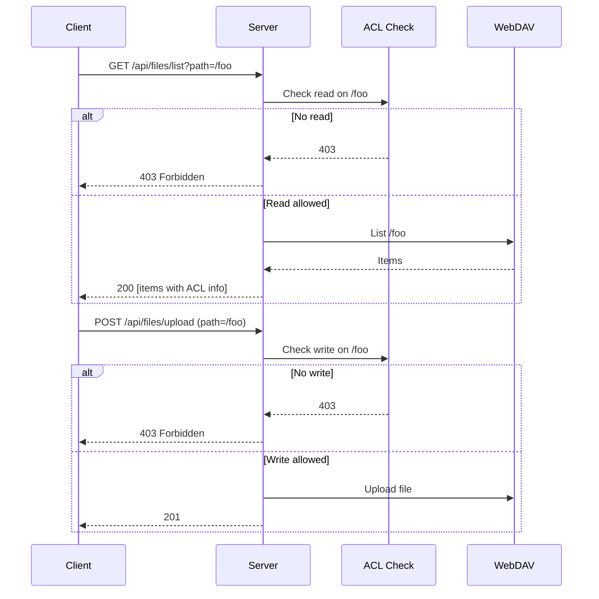
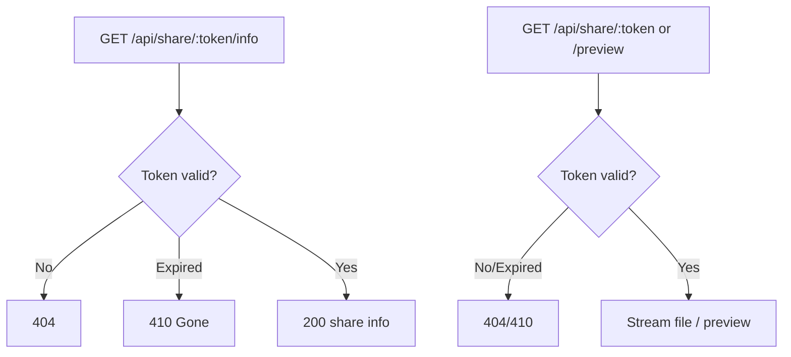

# Files, Folders, Sharing, and Recent Files

This document describes file and folder operations (CRUD, rename, batch move/copy/delete), thumbnails and preview, permission requests, share links, and recent files. It references [api.md](../api.md), [ARCHITECTURE.md](../ARCHITECTURE.md), and [permissions.md](permissions.md).

---

## Overview

Users manage files and folders through the API with path-based access. The server enforces ACL (direct read/direct write) on every request; list and read require permission on the folder or the file's parent, and write operations require write (or admin) on the target folder. Batch operations (move, copy, delete) use selective transfer/delete logic: the server traverses trees, checks ACL at each node, and only acts on allowed items; after completion it updates or revokes permission metadata. Thumbnails are generated server-side (images via Sharp, video frames via FFmpeg) and cached. Permission requests let users ask folder/file owners for access; share links provide time-limited public access to a file or folder. Recent files are stored per user and updated via apply-moves and remove-paths after bulk operations.

---

## Specification

### Files and Folders

- **List:** `GET /api/files/list?path=...` — Returns folder contents with ACL info. Path normalized; `/.wea` blocked for non-admin.
- **Download:** `GET /api/files/download?path=...` — Single file download (token or share token where supported).
- **Upload:** `POST /api/files/upload` — Multipart `file`, body/query `path`. Checks parent write permission.
- **Rename:** `PUT /api/files/rename` — Body: e.g. `oldPath`, `newName`.
- **Batch move:** `POST /api/files/batch-move` — Body: e.g. `sourcePaths`, `destinationPath` or `moves[]`. ACL updated for moved items.
- **Batch copy:** `POST /api/files/batch-copy` — Body: e.g. `sourcePaths`, `destinationPath` or `copies[]`. Conflict handling (e.g. `onConflict`) as per api.
- **Batch delete:** `POST /api/files/batch-delete` — Body: e.g. `paths`. Only items the user is allowed to delete; permission metadata cleaned up.
- **Create folder:** `POST /api/folders/create` — Body: `path`.
- **Check conflicts:** `POST /api/files/check-conflicts` — Body: e.g. `paths`, `destinationPath`. Used before paste.
- **Metadata:** `POST /api/files/metadata` — Body: e.g. `paths`.
- **Download multiple (ZIP):** `POST /api/files/download-multiple`, `GET /api/files/download-progress/:id`.
- **Bulk operation progress:** `GET /api/files/operation-progress/:id`, `GET /api/files/bulk-operation/:jobId`, `POST /api/files/bulk-operation/:jobId/cancel`.

All path parameters are normalized by middleware; `path`, `sourcePath`, `destinationPath`, `oldPath`, `folderPath` are normalized. Access to `/.wea` is blocked for non-admin (see [ARCHITECTURE.md](../ARCHITECTURE.md) and [permissions.md](permissions.md)).

### Thumbnails and Preview

- **Single:** `GET /api/files/thumbnail/:hash` or `GET /api/thumbnails/:hash.:ext` (optional token for shared content).
- **Batch:** `POST /api/files/thumbnails/batch` — Body: e.g. `paths` or items with path/hash. Used for viewport-based loading.
- Thumbnails: server-side resize (Sharp); video frame extraction via FFmpeg. Cached in memory (LRU, max 1000). See ARCHITECTURE §3.1.

### Permissions (grant/revoke)

- Grant: `POST /api/permissions/grant` — Body: `folderPath`, `userId`, `permission`; optional `target: 'file'` for file-level.
- Revoke: `DELETE /api/permissions/revoke` — Query: `userId`, `folderPath`; optional `includeSubfolders`, `scope`.
- Folder/file list and check: `GET /api/permissions/folder?path=...`, `GET /api/permissions/check?path=...`, and file-level endpoints as in [api.md](../api.md).

### Permission Requests

- Create: `POST /api/permission-requests` — Body: `folderPath` or `filePath`, `permission`, optional `message`.
- Inbox/outbox: `GET /api/permission-requests/inbox`, `GET /api/permission-requests/outbox`.
- Check owner: `GET /api/permission-requests/check-owner?folderPath=...` or `?filePath=...`.
- Actions: `POST /api/permission-requests/:id/approve`, `POST /api/permission-requests/:id/reject`, `POST /api/permission-requests/:id/cancel`.

### Share Links (authenticated)

- Create: `POST /api/share-links` — Body: e.g. `filePath`, `expiresInDays`.
- List/Get/Update/Delete: `GET /api/share-links`, `GET /api/share-links/:token`, `PUT /api/share-links/:token`, `DELETE /api/share-links/:token`.

### Share (public)

- Info: `GET /api/share/:token/info` — No auth; returns share link info (e.g. name, type, expiry). 410 when expired.
- Download: `GET /api/share/:token` — Public download.
- Preview: `GET /api/share/:token/preview` — Public preview.
- For logged-in users: `GET /api/share/:token/check-my-permission`, `POST /api/share/:token/add-to-my-permissions`.

### Recent Files

- List: `GET /api/recent-files`.
- Add: `POST /api/recent-files` — Body: `path`; optional `name`, `type`, `basename`.
- Remove one: `DELETE /api/recent-files/:filePath(*)` (path may contain slashes).
- Clear all: `DELETE /api/recent-files`.
- After bulk move: `POST /api/recent-files/apply-moves` — Body: array of moves (old path → new path).
- After delete: `POST /api/recent-files/remove-paths` — Body: `filePaths`, `folderPaths` arrays.

---

## Flows

### Folder list and upload

### Batch move and ACL / recent files

1. Client sends `POST /api/files/batch-move` with `moves` (or sourcePaths + destinationPath).
2. Server runs selective transfer: traverse source trees, check current user ACL at each path, move only allowed items; update `/.wea/permissions/...` for moved paths.
3. Client then calls `POST /api/recent-files/apply-moves` with the same move mapping so recent-file list stays in sync.
4. On batch delete, client calls `POST /api/recent-files/remove-paths` with `filePaths` and `folderPaths` to remove deleted items from recent list.

### Share link (public)

### Permission request lifecycle

- Requester: `POST /api/permission-requests` → request created (pending).
- Owner: `GET /api/permission-requests/inbox` → see request; `POST .../approve` or `.../reject`.
- Requester: `GET /api/permission-requests/outbox` → see status; `POST .../cancel` to cancel pending.
- State transitions: pending → approved | rejected | cancelled (see [shared-contracts.md](../shared-contracts.md) for `PERMISSION_REQUEST_STATUS`).

---

## Testing

When implementing or reviewing tests for files and sharing, cover at least:

**Scenario locations:**

| Scenario | Server test location | Client test location |
|----------|---------------------|---------------------|
| Create folder | folders.test.js | FileManager (create folder flow) |
| Upload | files.test.js | FileManager (upload flow) |
| Move (batch) | files.test.js | FileManager (bulk move) |
| Copy (batch) | files.test.js | FileManager (bulk copy) |
| Delete (batch) | files.test.js | FileManager (delete flow) |
| Rename | files.test.js | FileManager (rename flow) |
| Download (single) | files.test.js | FileManager (download) |
| Download multiple (ZIP) | files.test.js | FileManager (bulk download) |

**Coverage checklist:**
- **Direct read/write:** User without read on a folder gets 403 on list/download for that folder (or file under it). User without write on a folder gets 403 on upload/rename/move/copy/delete there. No inheritance from parent path (see [permissions.md](permissions.md)).
- **Reserved path:** Requests involving `/.wea` for non-admin → 403.
- **Batch operations:** After batch-move or batch-copy, only allowed items are moved/copied; ACL metadata updated. After batch-delete, permissions cleaned and recent-files remove-paths/apply-moves called where applicable.
- **check-conflicts:** Before paste, POST /api/files/check-conflicts returns conflicts array (files.test.js).
- **Bulk operation progress/cancel:** GET bulk-operation/:jobId, POST cancel (files.test.js).
- **Recent files:** apply-moves after bulk move; remove-paths after bulk delete (FileManager delete flow).
- **Share link expiry:** Expired share link → 410 on info/download/preview.
- **Permission request states:** Create → pending; owner approve → approved; owner reject → rejected; requester cancel → cancelled. Inbox/outbox and check-owner behave as specified.

Use [TESTING_STRATEGY.md](../TESTING_STRATEGY.md) and [api.md](../api.md) for contract and mocking guidance.
