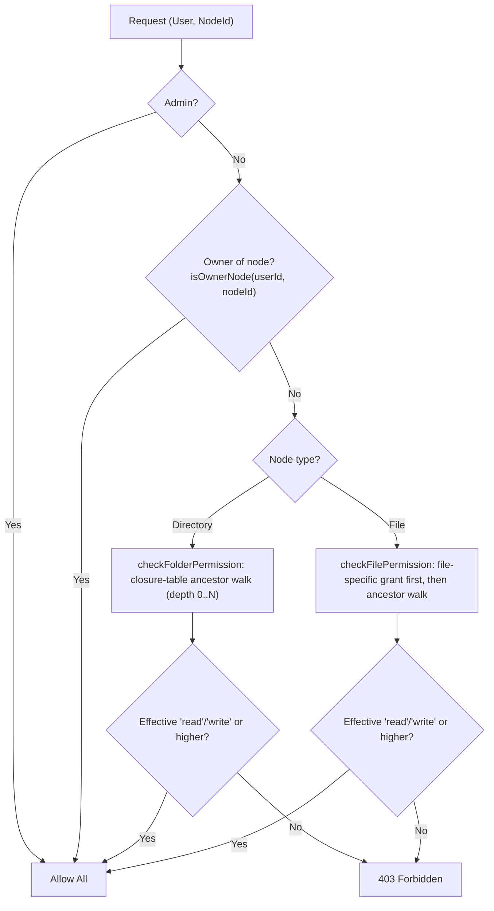

# Permission Model

This document describes the ACL (Access Control List) and permission rules used by WebDAV EasyAccess. Use it when implementing or testing permission-related behavior.

---

## Role of the ACL

The application runs its own **ACL** independent of the WebDAV server. Permissions are stored in PostgreSQL/sqlite via normalized permission tables (`permissions_user_paths`, `permissions_user_files`, `permissions_shares`). Every grant references a `file_node_id` (BIGINT into `file_nodes.id`), never a path string. Directory-level grants are inherited by descendants through the `node_ancestors` closure table. The WebDAV server may have its own permissions; the app layer enforces access based on this ACL on every API request.

---

## Permission Levels

Defined in `shared/constants.js` as `PERMISSIONS`:

| Level   | Value   | Typical use |
|--------|---------|-------------|
| read   | `read`  | List and download; see folder contents. |
| write  | `write` | Create, upload, rename, move, copy, delete in that folder. |
| admin  | `admin` | Same as write plus grant/revoke permissions for that folder. |

Use `PERMISSIONS.isValid(permission)` to check a value. Ordering for "higher" is: read &lt; write &lt; admin.

---

## Policy Rules

### Owner exception

- A user owns their **home root node** and every descendant of it in the `file_nodes` tree.
- Ownership is resolved by nodeId via the closure table: `isOwnerNode(userId, nodeId)` returns `true` when the target node is the user's root node or `fileNodesStore.isAncestor(rootNodeId, nodeId)` holds (see `server/domains/permissions/policy/ownerNodeResolver.js`).
- The owner has full access (read, write, and effectively admin) on owned nodes with **no explicit permission record** required.

### Inheritance via the closure table

- Permissions apply to a **node** (`file_node_id`), not a path. Directory-level grants (`permissions_user_paths`) are inherited by descendants through the `node_ancestors` closure table: depth 0 = the node itself, depth 1 = direct child, depth N = any descendant.
- **Grant/revoke on a folder affects the whole subtree:** granting read/write/admin on a directory makes it effective on every descendant unless a more specific grant overrides it; revoking on a directory removes the grant, and revocation with `includeDescendants=true` also removes grants explicitly stored on descendant nodes.
- Checking permission for a target node walks its ancestors (including self) and resolves to the closest explicit grant (`ORDER BY a.depth ASC LIMIT 1`). See [permissionStore.md](../spec/server/store/permissionStore.md#27-ancestor-inheritance).

### Read / Write

- **Read** on a directory node grants list/read of that folder and, via inheritance, its descendants. A file is readable when the effective permission on its node is `read` or higher.
- **Write** on a directory node grants create, upload, rename, move, copy, and delete within that folder and, via inheritance, its subtree (subject to more specific grants).
- A **file-specific grant** (`permissions_user_files`) always takes precedence over any inherited directory-level permission on that file node.

### Reserved path

- The reserved path `/.wea` holds application metadata and sits outside the node-based permission model. It is hidden and blocked in the UI and in the API for non-admin users (middleware `checkMetaPathAccess`); only admins can access `/.wea`. See [shared-contracts.md](../shared-contracts.md#path-rules) and [ARCHITECTURE.md](../ARCHITECTURE.md).

---

## Decision Flow

Checks are implemented in `server/domains/permissions/services/aclService.js` (`checkPermission`, `checkFilePermission`, `checkFolderPermission`) and resolve through `permissionStore.checkPermission` / `getEffectivePermission` via the closure table.

---

## API

All permission endpoints are nodeId-based; no path strings are accepted.

### Directory-level permissions

| Method | Path | Body / Query |
|--------|------|--------------|
| POST | `/api/permissions/grant` | Body: `{ userId, nodeId, permission }` — `nodeId` must reference a directory node; applies to the folder and, via closure-table inheritance, its subtree. |
| DELETE | `/api/permissions/revoke` | Query: `userId`, `nodeId`; optional `includeDescendants` (`true` also revokes grants stored on descendant nodes). |
| GET | `/api/permissions/user/:userId` | Returns `[{ nodeId, permission }]`. |
| GET | `/api/permissions/folder` | Query: `nodeId`; optional `includeDescendants`, `fileNodeId`. |
| GET | `/api/permissions/check` | Query: `nodeId`. Returns `{ nodeId, hasRead, hasWrite, source }`. |

### File-level permissions

| Method | Path | Body / Query |
|--------|------|--------------|
| POST | `/api/permissions/file/grant` | Body: `{ userId, fileNodeId, permission }`. |
| DELETE | `/api/permissions/file/revoke` | Query: `userId`, `fileNodeId`. |
| PATCH | `/api/permissions/file` | Body: `{ userId, fileNodeId, permission }`. |
| GET | `/api/permissions/file/check` | Query: `fileNodeId`. Returns `{ nodeId, hasRead, hasWrite, source }`. |
| GET | `/api/permissions/file/list` | Query: optional `parentNodeId` (filters to files under that node). |

Source: `server/domains/permissions/routes/folderPermissions.js`, `filePermissions.js`, `queries.js`.

---

## Testing

When writing or reviewing permission tests, cover at least:

For user-facing negative browser flows that intersect with permissions, see [../E2E_COVERAGE_PLAN.md](../E2E_COVERAGE_PLAN.md). Keep the full ACL allow/deny matrix primarily in middleware, route integration, and related lower-level tests.

- **Ancestor inheritance:** Grant read on a directory node; a user can list that folder and its descendants without explicit grants on the descendants (depth N resolution).
- **Depth 0 vs depth N:** A grant on the target node itself (depth 0) wins over a weaker grant inherited from an ancestor.
- **File grant precedence:** A file-specific grant overrides an inherited directory-level permission on the same file node.
- **Subtree grant/revoke:** Granting on a folder applies to the subtree; revoking with `includeDescendants=true` clears grants stored on descendant nodes.
- **Owner exception:** The owner of a node (own root node or any descendant) has full access without explicit grants.

These scenarios should be verified in both middleware/unit tests and API integration tests.

---

## Permissions List Freshness and Reconciliation

- `GET /api/permissions/user/:userId` uses a fast read path that avoids per-item synchronous WebDAV existence checks.
- User-visible response shape remains backward-compatible.
- Node visibility is decided from an existence index with asynchronous reconciliation.
- Stale index entries are refreshed in non-blocking background jobs with bounded concurrency.
- ACL mutation flows invalidate affected index entries so subsequent reads converge quickly.
- Conditional requests can return `304 Not Modified` when `If-None-Match` matches current permission/index freshness markers.
- For full route-level semantics and env knobs, see `docs/spec/server/routes/permissions.md` and `docs/spec/server/utils/webdav.md`.

## Client-side permissions request dedupe

- Multiple UI consumers can request `GET /api/permissions/user/:userId` at nearly the same time.
- `permissionService` consolidates these calls through in-flight dedupe and short TTL memoization.
- ACL mutation actions invalidate affected user-permission cache entries so subsequent reads are fresh.
- For API-level behavior and cache control details (`forceRefresh`, manual clear), see `docs/spec/client/services/permissionService.md`.
