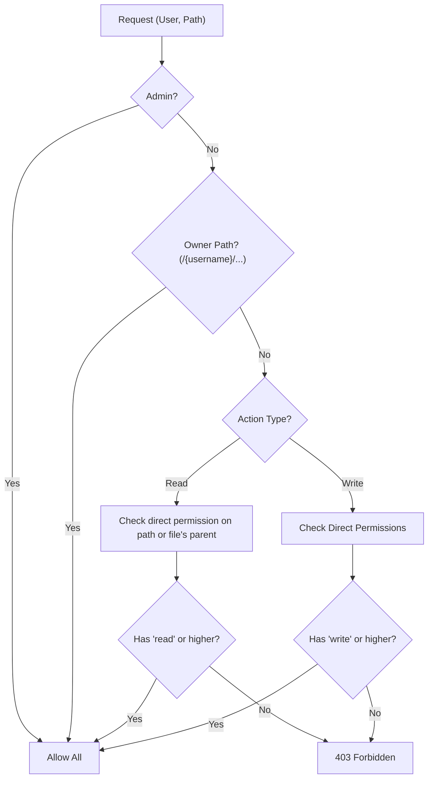

# Permission Model

This document describes the ACL (Access Control List) and permission rules used by WebDAV EasyAccess. Use it when implementing or testing permission-related behavior.

---

## Role of the ACL

The application runs its own **ACL** independent of the WebDAV server. Permissions are stored in PostgreSQL/sqlite via normalized permission tables (`permissions_user_paths`, `permissions_user_files`, `permissions_shares`). The WebDAV server may have its own permissions; the app layer enforces access based on this ACL on every API request.

---

## Permission Levels

Defined in `shared/constants.js` as `PERMISSIONS`:

| Level   | Value   | Typical use |
|--------|---------|-------------|
| read   | `read`  | List and download; see folder contents. |
| write  | `write` | Create, upload, rename, move, copy, delete in that folder. |
| admin  | `admin` | Same as write plus grant/revoke permissions for that folder. |

Use `PERMISSIONS.isValid(permission)` to check a value. Ordering for "higher" is: read &lt; write &lt; admin.

---

## Policy Rules

### Owner exception

- Paths under `/{username}` (the user's home directory) always grant that user **read and write** (and effectively admin for their own home).
- No explicit permission record is required for the owner on their home path.

### Read: direct only

- Read is required **on that folder** (for list) or on the **file's direct parent folder** (for reading a file). There is **no inheritance** from parent to child.
- Example: Read on `/share` does **not** grant read on `/share/sub` unless explicitly granted.

### Write: direct only

- **Write** permission applies only when explicitly granted **on that folder**. It does **not** inherit to children.
- Example: Write on `/share` does **not** imply write on `/share/sub` unless the user has write (or admin) explicitly on `/share/sub`.

### Reserved path

- The path `/.wea` is reserved for application metadata. It is hidden and blocked in the UI and in the API for non-admin users. Only admins can access `/.wea`. See [shared-contracts.md](../shared-contracts.md#path-rules) and [ARCHITECTURE.md](../ARCHITECTURE.md).

---

## Decision Flow

(Source: [ARCHITECTURE.md](../ARCHITECTURE.md) §1.2.)

---

## Testing

When writing or reviewing permission tests, cover at least:

For user-facing negative browser flows that intersect with permissions, see [../E2E_COVERAGE_PLAN.md](../E2E_COVERAGE_PLAN.md). Keep the full ACL allow/deny matrix primarily in middleware, route integration, and related lower-level tests.

- **Direct read:** User needs read on that folder (or file's parent) to list/read; no parent inheritance.
- **Direct write:** User with write only on a parent cannot write to a child path without explicit write there.
- **Owner exception:** Owner can read and write their home `/{username}` and all paths under it without explicit grants.

These scenarios should be verified in both middleware/unit tests and API integration tests.

---

## Permissions List Freshness and Reconciliation

- `GET /api/permissions/user/:userId` uses a fast read path that avoids per-item synchronous WebDAV existence checks.
- User-visible response shape remains backward-compatible.
- Path visibility is decided from an existence index with asynchronous reconciliation.
- Stale index entries are refreshed in non-blocking background jobs with bounded concurrency.
- ACL mutation flows invalidate affected index entries so subsequent reads converge quickly.
- Conditional requests can return `304 Not Modified` when `If-None-Match` matches current permission/index freshness markers.
- For full route-level semantics and env knobs, see `docs/spec/server/routes/permissions.md` and `docs/spec/server/utils/webdav.md`.

## Client-side permissions request dedupe

- Multiple UI consumers can request `GET /api/permissions/user/:userId` at nearly the same time.
- `permissionService` consolidates these calls through in-flight dedupe and short TTL memoization.
- ACL mutation actions invalidate affected user-permission cache entries so subsequent reads are fresh.
- For API-level behavior and cache control details (`forceRefresh`, manual clear), see `docs/spec/client/services/permissionService.md`.
